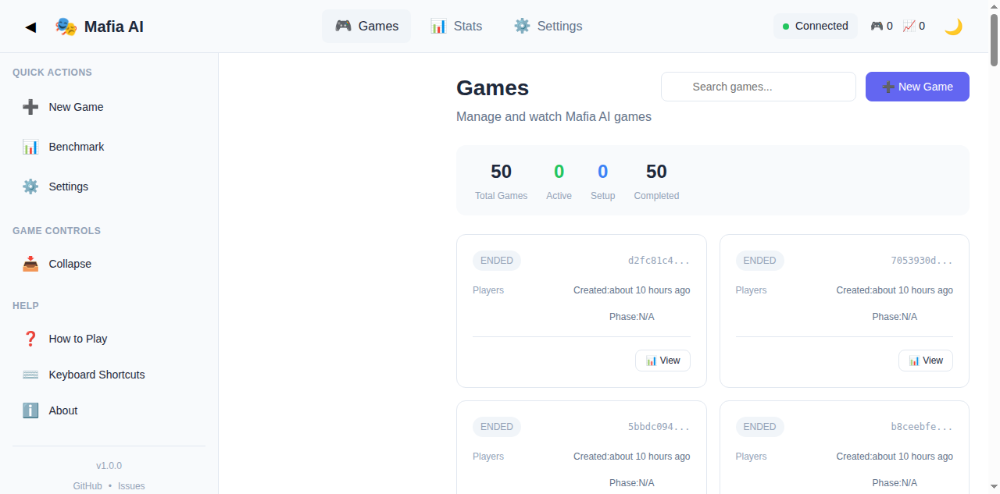

# 🎮 Mafia AI Benchmark

An advanced AI-powered Mafia game simulation that benchmarks different AI models' ability to play the classic social deduction game. Features real-time game mechanics, role-based strategies, comprehensive event sourcing, and rich AI personas.

<p align="center">
  
</p>

## 🖥️ Web Dashboard

<p align="center">
  
  <br>
  <em>Manage and watch games from the browser — live game states, stats, and benchmarks.</em>
</p>

## ✨ Features

- **🤖 AI Agents**: Autonomous players powered by LLMs (GPT-4o-mini, Claude, etc.)
- **🔀 Multiple AI Providers**: Benchmark any OpenRouter model head-to-head per player — e.g. `benchmark --models openai/gpt-4o-mini,openai/gpt-4o` (see [FLEXIBLE_PLAYER_MODELS.md](FLEXIBLE_PLAYER_MODELS.md) and [PERSONALIZED_AI_MODELS.md](PERSONALIZED_AI_MODELS.md))
- **🎭 Dynamic Personas**: Unique characters with diverse backgrounds, communication styles, and personalities
- **🎛️ Full Configuration**: Control players, roles, messaging limits, AI models, and more
- **🎯 Correct Game Flow**: Mafia team discussion with consensus (not single-turn votes)
- **💬 Split-Pane Consciousness**: Private reasoning (THINK) vs public statements (SAYS)
- **🌙 Night Phase**: Mafia discussion, Doctor protection, Sheriff investigation, Vigilante action
- **☀️ Day Phase**: Discussion, voting, lynching
- **📊 Event Sourcing**: Complete game audit trail with visibility levels
- **💰 Cost Tracking**: Track API costs per game and player
- **🧪 967 Tests**: Comprehensive test coverage (410 shared, 392 server, 101 CLI, 64 web)

## 🚀 Quick Start

**New here?** Start with **[QUICK_START.md](QUICK_START.md)** - 5 minute setup guide!

### TL;DR - Get Running Now

```bash
cd mafia-ai-benchmark

# 1. Install dependencies
pnpm install

# 2. Copy the sample env and add your API key (required!)
cp .env.sample .env
nano .env

# Note: `docker compose up` works without .env (env_file is optional); the
# server boots but LLM-backed games need real keys copied from .env.sample.

# OPENAI_API_KEY=sk-or-v1-YOUR-KEY-HERE
# OPENAI_BASE_URL and MODEL are also required — see .env.sample for all options

# 3. Build all packages
pnpm build

# 4. Start the server
pnpm --filter @mafia/server dev

# 5. In another terminal, run a benchmark
pnpm --filter @mafia/cli dev -- benchmark

# Benchmark multiple models head-to-head (default: openai/gpt-4o-mini,openai/gpt-4o)
pnpm --filter @mafia/cli dev -- benchmark --models openai/gpt-4o-mini,openai/gpt-4o
```

### Docker Quick Path

No Node.js or pnpm on the host? The compose stack builds everything inside
Docker — the only install path that skips the fresh-clone pnpm setup entirely:

```bash
# 1. Copy the sample env and add your API key (required!)
cp .env.sample .env
nano .env
# OPENAI_API_KEY=sk-or-...HERE

# 2. Build and start the full stack (server + web dashboard)
docker compose up -d --build

# 3. Open the dashboard and check the API
#    Dashboard: http://localhost:5174
#    API health: http://localhost:3004/health
```

**Prerequisite:** Docker Engine **plus** the Docker Compose v2 plugin
(`docker compose`, the subcommand — NOT the legacy `docker-compose` binary).
On a bare Debian/Ubuntu host that means installing the `docker-compose-plugin`
(or `docker-compose-v2`) package alongside Docker Engine. If you have no
root/sudo access on the host, there is no compose path — fall back to the pnpm
steps above.

Already have the stack up and just pulled code changes? The container only
runs what it was built with — see the **Docker Deployment** section of
[QUICK_START.md](QUICK_START.md) for the rebuild-after-code-change rule.

### What You'll See

```
🎮 Mafia AI Benchmark - Monorepo Edition
🔒 Generating personas...
  😈 Vincent Marino (MAFIA) - Traits: analytical, reserved, meticulous
  😈 Francesco 'Frankie' Moretti (MAFIA) - Traits: empathetic, determined
  💉 Vincent 'Vince' Romano (DOCTOR) - Traits: charismatic, trustworthy
  👮 Margaret 'Maggie' Sinclair (SHERIFF) - Traits: observant, friendly

🌙 NIGHT 1
😈 Mafia Chat: Real strategy discussion...
💉 Doctor: Protects someone...
👮 Sheriff: Investigates someone...

☀️ DAY 1
💬 Discussion and voting...
🏆 Mafia or Town wins!
```

## 📖 Documentation

| Document                                                       | Purpose                            |
| -------------------------------------------------------------- | ---------------------------------- |
| **[README.md](README.md)**                                     | This file - quick start & overview |
| **[QUICK_REFERENCE.md](QUICK_REFERENCE.md)**                   | Command cheat sheet                |
| **[CONFIG_GUIDE.md](CONFIG_GUIDE.md)**                         | Complete configuration guide       |
| **[GAME_MANAGEMENT.md](GAME_MANAGEMENT.md)**                   | Detailed game management           |
| **[ARCHITECTURE.md](ARCHITECTURE.md)**                         | System architecture & design       |
| **[PROJECT_READY.md](PROJECT_READY.md)**                       | Complete system summary            |
| **[POSTER.md](POSTER.md)**                                     | Visual system overview             |
| **[specs/correct-night-flow.md](specs/correct-night-flow.md)** | Game flow specification            |
| **[specs/persona-system.md](specs/persona-system.md)**         | Persona system documentation       |
| **[docs/api-reference.md](docs/api-reference.md)**             | API reference & integration guide  |
| OpenAPI spec: `apps/server/openapi.yaml`                       | Machine-readable API spec          |

## 🎭 Persona System

Each AI agent now has a unique persona!

### Features

- **6 Archetype Categories**: Historical, Fictional, Anime, Stereotypes, Abstract, Fantasy
- **8 Communication Styles**: Formal, Casual, Southern, British, Gangster, Valley Girl, Southern Gentleman, Pirate
- **Diverse Names**: Western, Eastern, Latin, Nordic, African naming conventions
- **Rich Backstories**: Origin stories that inform decision-making
- **Personal Flaws**: Weaknesses that affect gameplay

### Example Persona

```
🎭 James "Ace" Tanaka (Julius Caesar archetype)
   📝 Origin: Former military commander who led successful campaigns
   💬 Communication: Formal with dry, intellectual humor
   ⭐ Traits: Charismatic, Strategic, Ambitious
   💔 Flaw: Prideful - struggles to admit when wrong
   🗣️ Verbal Tics: "Indeed", "Furthermore"
```

See **[specs/persona-system.md](specs/persona-system.md)** for complete documentation.

## 🎛️ Configuration System

The CLI has two configuration surfaces: **run-game flags** (per-game overrides) and **persistent config** (stored in `mafia.config.json`).

### Run-Game Flags

Pass these to `run-game` to override defaults for a single game:

```bash
pnpm --filter @mafia/cli dev -- run-game [options]

Options:
  --players <n>        Number of players (default: 10)
  --provider <name>    LLM provider (default: "openai")
  --model <name>       LLM model (default: "openai/gpt-4o-mini")
  --auto, --yes        Run without confirmation prompt
  --watch              Watch game in real-time
  --server <url>       Server base URL (default: http://localhost:3004)
  -c, --config <path>  Configuration file path (default: "./mafia.config.json")
```

**Example:**

```bash
# 7-player game with GPT-4o, auto-start, watch live
pnpm --filter @mafia/cli dev -- run-game --players 7 --model openai/gpt-4o --auto --watch
```

### Persistent Config Commands

The `config` subcommand manages `mafia.config.json` (game parameters that persist across runs):

```bash
# Show current configuration
pnpm --filter @mafia/cli run config show

# Set a configuration value (arbitrary JSON key)
pnpm --filter @mafia/cli run config set <key> <value>

# Reset to default settings
pnpm --filter @mafia/cli run config reset
```

> **Note:** `pnpm --filter @mafia/cli config ...` is intercepted by pnpm's built-in `config` command (ERR_PNPM_RECURSIVE_RUN_NO_SCRIPT), so config subcommands use the `run config ...` form (see line 230 note).

Role counts (mafia/doctor/sheriff/vigilante), messaging limits, and day-rounds are configured via `config set` or directly in `mafia.config.json` — they are NOT command-line flags.

See **[CONFIG_GUIDE.md](CONFIG_GUIDE.md)** for complete documentation of all configurable parameters.

## 🎯 Game Flow (Corrected)

### Night Phase

1. **😈 Mafia Team Chat** - Mafia discuss (multiple messages each) and reach consensus
2. **💉 Doctor Action** - Doctor protects someone (can't repeat twice)
3. **👮 Sheriff Investigation** - Sheriff learns exact role of target
4. **🔫 Vigilante Action** - Vigilante can shoot once (or pass)
5. **🌅 Night Resolution** - Deaths revealed, game continues

### Day Phase

1. **💬 Discussion** - All players discuss (configurable messages)
2. **🗳️ Voting** - Players vote to lynch someone
3. **🏆 Win Check** - Mafia wins if ≥ town, Town wins if all mafia eliminated

See **[specs/correct-night-flow.md](specs/correct-night-flow.md)** for complete specification.

## 📁 Commands Guide

### CLI Commands (via `mafiactl`)

| Command | Purpose | When to Use |
| --- | --- | --- |
| `pnpm --filter @mafia/cli game:run` | **Run a game** | Playing Mafia with AI agents |
| `pnpm --filter @mafia/cli dev -- benchmark` | **Run benchmark** | Automated model evaluation |
| `pnpm --filter @mafia/cli stats` | **View stats** | Game and model statistics |
| `pnpm --filter @mafia/cli list-games` | **List games** | Browse recent games |
| `pnpm --filter @mafia/cli run config show` | **View config** | Check current settings |
| `pnpm --filter @mafia/cli run config set <key> <value>` | **Configure** | Customize game params |

> **Note:** `pnpm --filter @mafia/cli config ...` is intercepted by pnpm's built-in `config` command (ERR_PNPM_RECURSIVE_RUN_NO_SCRIPT / "Unknown option"), so config subcommands use the `run config ...` form. `stats` and `list-games` work directly as scripts.

> **Note — non-interactive shells (cron / CI / agents):** pnpm 11 runs a
> dependency check before every script and aborts in non-TTY shells with
> `ERR_PNPM_ABORTED_REMOVE_MODULES_DIR_NO_TTY` whenever it decides
> `node_modules` must be re-provisioned (stale or symlinked `node_modules` —
> the normal state in worktrees, fresh automation checkouts, and after config
> changes). This repo sets `confirmModulesPurge: false` in
> `pnpm-workspace.yaml`, so the documented invocations above work unattended.
> In checkouts without that setting (older clones, forks), prefix the command
> with `CI=true` (e.g. `CI=true pnpm --filter @mafia/cli dev -- benchmark`)
> or run the built CLI directly: `node apps/cli/dist/index.js <cmd>`.

### Server Commands

| Command | Purpose | When to Use |
| --- | --- | --- |
| `pnpm --filter @mafia/server dev` | **Start server** | Run REST API + WebSocket |
| `pnpm --filter @mafia/server test:run` | **Run tests** | Verify server tests (392) |

### Root Commands

```bash
pnpm install              # Install all dependencies
pnpm build                # Build all packages (4/4)
pnpm --filter @mafia/server test:run    # Server tests (392)
pnpm --filter @mafia/shared test:run    # Shared tests (410)
pnpm --filter @mafia/web test:run       # Web tests (64)
```

## 🎭 Roles

| Role          | Ability                           | Win Condition        |
| ------------- | --------------------------------- | -------------------- |
| **Mafia**     | Kill one player each night        | Survive until ≥ town |
| **Doctor**    | Protect one player each night     | Town victory         |
| **Sheriff**   | Investigate exact role each night | Town victory         |
| **Vigilante** | Shoot one player once             | Town victory         |
| **Villager**  | Vote and discuss                  | Town victory         |

## 🔧 Development

### Project Structure

```
mafia-ai-benchmark/
├── apps/
│   ├── server/                  ✅ HTTP/WebSocket server + game engine
│   ├── cli/                     ✅ TypeScript CLI (mafiactl)
│   └── web/                     ✅ React frontend
├── packages/shared/             ✅ Shared types, FSM, roles, personas
│   ├── src/
│   │   ├── fsm/                 ✅ Game state machine
│   │   ├── roles/               ✅ Role definitions
│   │   ├── events/              ✅ Event definitions
│   │   ├── providers/           ✅ AI provider configs
│   │   └── persona/             ✅ Persona generation
│   └── __tests__/               ✅ 410 tests
├── specs/                       ✅ Technical specifications
├── pnpm-workspace.yaml          ✅ Monorepo workspace config
├── turbo.json                   ✅ Build pipeline config
└── .env                         ✅ API keys (create from .env.sample)
```

### Running Tests

```bash
# All tests from root
pnpm --filter @mafia/server test:run   # Server (392 tests)
pnpm --filter @mafia/shared test:run   # Shared (410 tests)
pnpm --filter @mafia/web test:run      # Web (64 tests)
```

**Test Coverage**: 967 tests (410 shared, 392 server, 101 CLI, 64 web)

**Test counts are generated — don't hand-edit them.** Every test count in this
README is produced from live vitest output by `pnpm test:counts`
(`scripts/sync-test-counts.mjs`). Run it after adding or removing tests to
regenerate all counts from the suites' own "Tests" summary lines.

### Game Events

Each game action is stored as an event with visibility levels:

```json
{
  "gameId": "game-123",
  "round": 1,
  "phase": "NIGHT",
  "playerName": "James Tanaka",
  "personaArchetype": "Julius Caesar",
  "eventType": "MESSAGE",
  "visibility": "PRIVATE_MAFIA", // PUBLIC, PRIVATE_MAFIA, ADMIN_ONLY
  "content": {
    "think": "Private reasoning in character...",
    "says": "Public statement in character...",
    "personaTraits": ["Charismatic", "Strategic", "Ambitious"]
  }
}
```

## 🐛 Bug Fixes Applied

### ✅ Information Leakage Fixed

**Issue**: Doctor/Sheriff/Vigilante could see mafia's target in their prompts
**Fix**: Removed `mafiaKillTarget` from their `previousPhaseData`

### ✅ Variable Scope Fixed

**Issue**: `mafiaKillTarget` not accessible across phases
**Fix**: Declared at class level: `this.mafiaKillTarget = null`

### ✅ Configuration System Added

**Feature**: Comprehensive CLI configuration with 15+ options

- Player/role settings
- Messaging limits
- AI model selection
- Persistent config file
- Interactive menu

### ✅ Persona System Added

**Feature**: Rich, dynamic characters with:

- 6 archetype categories
- 8 communication styles
- Diverse naming conventions
- Personal backstories and flaws

## 🚀 Coming Soon

- **Pre-made Scenarios** - Test specific game states
- **Persona Memory** - Characters remember past events

## 📝 Notes

- **Use `pnpm --filter @mafia/cli game:run`** to run games
- Games persist between sessions in the server database
- AI models use GPT-4o-mini via OpenRouter (configurable via `--model`)
- Role assignments are random each game
- Personas are unique each game, generated by the LLM from personality descriptions

## 🤝 Contributing

1. Fork the repository
2. Create a feature branch
3. Add tests for new functionality
4. Ensure all tests pass
5. Submit pull request

## 📄 License

MIT License - see LICENSE file

---

**Status**: ✅ Production Ready | ✅ Fully Documented | ✅ 967 Tests (all 967 passing: 410 shared, 392 server, 101 CLI, 64 web)

**Quick Start**: See [QUICK_START.md](QUICK_START.md) for 5-minute setup guide!

Built with ❤️ for AI research and game theory exploration
