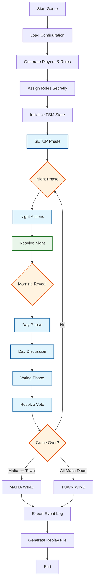
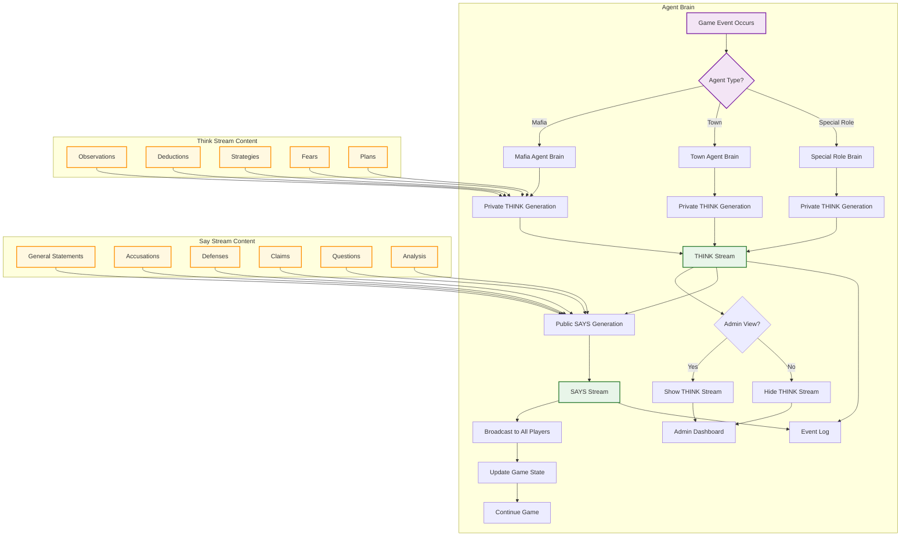

# Mafia AI Benchmark - System Architecture Flows

## Overview

This document provides comprehensive Mermaid flowcharts showing all system flows, from high-level game state transitions to detailed agent decision-making processes.

## Table of Contents

1. [High-Level Game Flow](#1-high-level-game-flow)
2. [Split-Pane Consciousness Flow](#2-split-pane-consciousness-flow)
3. [Night Phase Flow](#3-night-phase-flow)
4. [Day Phase Flow](#4-day-phase-flow)
5. [Voting Phase Flow](#5-voting-phase-flow)
6. [Evidence & Case Building Flow](#6-evidence--case-building-flow)
7. [Mafia Coordination Flow](#7-mafia-coordination-flow)
8. [Agent Decision Flow](#8-agent-decision-flow)
9. [State Machine Transitions](#9-state-machine-transitions)
10. [Event Sourcing Flow](#10-event-sourcing-flow)
11. [Visualization Flow](#11-visualization-flow)

---

## 1. High-Level Game Flow



### Flow Description

1. **Initialization**: Game loads configuration, generates players, assigns roles secretly
2. **Night Phase**: Mafia kills, Doctor protects, Sheriff investigates, Vigilante may shoot
3. **Morning Reveal**: Announce deaths (unless prevented)
4. **Day Phase**: Public discussion, evidence sharing, case building
5. **Voting**: Players vote to eliminate one player
6. **Resolution**: Check win conditions, continue or end game
7. **Export**: Generate replay file and event log

---

## 2. Split-Pane Consciousness Flow



### Flow Description

1. **Event Trigger**: Game event triggers agent processing
2. **Role-Based Processing**: Mafia, Town, and Special Roles process differently
3. **THINK Generation**: Private reasoning based on role and context
4. **THINK Visibility**: Only visible to admin/observers
5. **SAYS Generation**: Public statements based on private reasoning
6. **SAYS Broadcast**: Visible to all players
7. **Event Logging**: Both streams logged for replay

---

## 3. Night Phase Flow

```mermaid
graph TD
    subgraph "Night Phase Initialization"
        A[FSM Transitions to NIGHT_ACTIONS] --> B[Notify All Agents]
        B --> C[Enable Mafia Private Chat]
        C --> D[Enable Role Actions]
    end
    
    subgraph "Mafia Team Flow"
        E[Mafia Receive Private Chat] --> F[Mafia Discussion]
        F --> G[Share Observations]
        G --> H[Share Evidence]
        H --> I[Propose Kill Target]
        I --> J[Team Vote on Target]
        J --> K{Consensus?}
        K -->|Yes| L[Confirm Kill Target]
        K -->|No| M[Tie-Breaker RNG]
        M --> L
        L --> N[Submit Mafia Kill Action]
    end
    
    subgraph "Doctor Flow"
        O[Doctor Private Reasoning] --> P[Analyze Protection Options]
        P --> Q[Check Protection History]
        Q --> R[Consider Self-Protection]
        R --> S[Select Protection Target]
        S --> T[Submit Doctor Protect Action]
    end
    
    subgraph "Sheriff Flow"
        U[Sheriff Private Reasoning] --> V[Analyze Investigation Options]
        V --> W[Review Evidence Database]
        W --> X[Select Investigation Target]
        X --> Y[Submit Sheriff Investigate Action]
    end
    
    subgraph "Vigilante Flow"
        Z[Vigilante Private Reasoning] --> AA[Assess Confidence Level]
        AA --> BB[Calculate Shot Timing]
        BB --> CC{Shoot?}
        CC -->|Yes| DD[Select Target]
        CC -->|No| EE[Wait - No Action]
        DD --> FF[Submit Vigilante Shoot Action]
        EE --> GG[Record: No Shot Tonight]
    end
    
    subgraph "Resolution"
        NN[Wait for All Actions] --> OO[Resolve Simultaneous Actions]
        OO --> PP[Check Protection vs Kill]
        PP --> QQ[Apply Vigilante Shot]
        QQ --> RR[Generate Morning Results]
        RR --> SS[Transition to MORNING_REVEAL]
    end
    
    %% Connections
    N --> NN
    T --> NN
    Y --> NN
    FF --> NN
    GG --> NN
    
    classDef role fill:#e3f2fd,stroke:#1565c0,stroke-width:2px
    classDef action fill:#e8f5e9,stroke:#2e7d32,stroke-width:2px
    classDef decision fill:#fff3e0,stroke:#e65100,stroke-width:2px
    class E,F,G,H,I,J,K,L,N role
    O,P,Q,R,S,T action
    Z,AA,BB,CC decision
```

### Flow Description

1. **Initialization**: FSM transitions to NIGHT_ACTIONS, mafia private chat enabled
2. **Mafia Coordination**: Mafia team discusses, votes, and submits kill target
3. **Doctor Protection**: Doctor analyzes options and submits protection
4. **Sheriff Investigation**: Sheriff selects target and submits investigation
5. **Vigilante Decision**: Vigilante assesses confidence and decides whether to shoot
6. **Resolution**: All actions resolved simultaneously, morning results generated

---

## 4. Day Phase Flow

```mermaid
graph TD
    subgraph "Morning Reveal"
        A[MORNING_REVEAL Phase] --> B[Announce Deaths]
        B --> C{Death Prevented?}
        C -->|Yes| D[Announce: No Death - Protection Successful]
        C -->|No| E[Announce: Player Killed]
        D --> F[Reveal Role?]
        E --> F
        F -->|Yes| G[Show Eliminated Player Role]
        F -->|No| H[Keep Role Hidden]
        G --> I
        H --> I
    end
    
    subgraph "Day Discussion - Agent Turn"
        I[Start Day Discussion] --> J[Turn Order Determined]
        J --> K[Current Agent's Turn]
        
        K --> L[Agent THINK Generation]
        L --> M[THINK Stream - Private]
        M --> N[Agent SAYS Generation]
        N --> O[SAYS Stream - Public]
        O --> P[Broadcast to All Players]
        P --> Q{More Agents?}
        Q -->|Yes| R[Next Agent's Turn]
        Q -->|No| S[End Discussion Phase]
        R --> K
    end
    
    subgraph "Public Statement Types"
        T[Observations] --> L
        U[Accusations] --> L
        V[Defenses] --> L
        W[Role Claims] --> L
        X[Questions] --> L
        Y[Evidence Sharing] --> L
    end
    
    subgraph "Reactions"
        Z[Other Agents Process Statement] --> AA[Update Evidence Database]
        AA --> BB[Update Behavior Profiles]
        BB --> CC[Adjust Suspicion Scores]
        CC --> DD[Build/Update Cases]
        DD --> EE[Prepare Responses]
    end
    
    S --> FF[Transition to VOTING]
    
    classDef phase fill:#e1f5fe,stroke:#01579b,stroke-width:2px
    classDef action fill:#e8f5e9,stroke:#2e7d32,stroke-width:2px
    classDef process fill:#fff3e0,stroke:#e65100,stroke-width:2px
    class A,I,S,FF phase
    B,C,F,J,K,L,N,O,P action
    Z,AA,BB,CC,DD,EE process
```

### Flow Description

1. **Morning Reveal**: Announce deaths, show roles (if revealed)
2. **Discussion Turn Order**: Each agent takes turns making statements
3. **Agent Turn**: Generate THINK (private) → SAYS (public) → Broadcast
4. **Statement Types**: Observations, accusations, defenses, claims, questions, evidence
5. **Reactions**: Other agents process statements, update evidence, adjust suspicion
6. **Transition**: Move to VOTING phase

---

## 5. Voting Phase Flow

```mermaid
graph TD
    subgraph "Voting Phase Start"
        A[FSM Transitions to VOTING] --> B[Clear Previous Votes]
        B --> C[Initialize Vote Count]
        C --> D[Open Voting Window]
    end
    
    subgraph "Individual Vote Decision"
        E[Agent Receives Voting Prompt] --> F[Review Evidence]
        F --> G[Review Suspicion Scores]
        G --> H[Review Behavior Profiles]
        H --> I[Review Cases Built]
        I --> J[Generate THINK - Vote Reasoning]
        J --> K[Select Vote Target]
        K --> L{Abstain?}
        L -->|Yes| M[Generate Abstention Reasoning]
        L -->|No| N[Generate Vote Reasoning]
        M --> O[Submit Vote]
        N --> O
        O --> P[Record Vote Timestamp]
    end
    
    subgraph "Vote Types"
        Q[Evidence-Based Vote] --> K
        R[Suspicion-Based Vote] --> K
        S[Strategic Abstention] --> L
        T[Bandwagon Vote] --> K
    end
    
    subgraph "Vote Collection"
        U[Wait for All Votes] --> V{All Votes In?}
        V -->|No| W[Send Reminders]
        W --> U
        V -->|Yes| X[Close Voting]
    end
    
    subgraph "Vote Resolution"
        X --> Y[Count Votes]
        Y --> Z[Identify Target(s)]
        Z --> AA{Majority?}
        AA -->|Yes| BB[Eliminate Target]
        AA -->|No| CC[No Elimination - Tie]
        BB --> DD[Reveal Role?]
        CC --> EE[RNG Tie-Breaker]
        EE --> BB
        DD -->|Yes| FF[Show Eliminated Player Role]
        DD -->|No| GG[Keep Role Hidden]
        FF --> HH[Update Game State]
        GG --> HH
    end
    
    subgraph "Post-Vote Analysis"
        HH --> II[Record Vote Patterns]
        II --> JJ[Update Behavior Profiles]
        JJ --> KK[Adjust Suspicion Scores]
        KK --> LL[Check Win Conditions]
    end
    
    LL --> MM{Game Over?}
    MM -->|Yes| NN[Transition to END]
    MM -->|No| OO[Transition to Next Night]
    
    classDef phase fill:#e1f5fe,stroke:#01579b,stroke-width:2px
    classDef decision fill:#fff3e0,stroke:#e65100,stroke-width:2px
    classDef action fill:#e8f5e9,stroke:#2e7d32,stroke-width:2px
    class A,U,X,MM,NN,OO phase
    E,F,G,H,I,J,K,L,M,N,O,P decision
    B,C,D,Y,Z,AA,BB,CC,DD,EE,FF,GG,HH,II,JJ,KK,LL action
```

### Flow Description

1. **Voting Start**: FSM transitions to VOTING, initialize vote count
2. **Individual Decision**: Each agent reviews evidence, profiles, cases, generates THINK, selects target
3. **Vote Types**: Evidence-based, suspicion-based, strategic, bandwagon
4. **Collection**: Wait for all votes, send reminders if needed
5. **Resolution**: Count votes, identify target, handle ties, reveal role
6. **Post-Vote**: Record patterns, update profiles, check win conditions
7. **Transition**: Next night or game end

---

## 6. Evidence & Case Building Flow

```mermaid
graph TD
    subgraph "Evidence Collection"
        A[Game Event Occurs] --> B[Agent Observes Event]
        B --> C{Collect Evidence?}
        C -->|Yes| D[Generate Evidence Object]
        C -->|No| E[Skip - No Action]
        D --> F[Store in Evidence Database]
        F --> G[Tag Evidence Type]
        G --> H[Link to Source/Target]
    end
    
    subgraph "Evidence Types"
        I[Voting Evidence] --> B
        J[Statement Evidence] --> B
        K[Behavior Evidence] --> B
        L[Timing Evidence] --> B
        M[Investigation Evidence] --> B
        N[Role Reveal Evidence] --> B
    end
    
    subgraph "Evidence Analysis"
        O[New Evidence Added] --> P[Update Agent Suspicion]
        P --> Q[Check for Contradictions]
        Q --> R[Identify Patterns]
        R --> S[Generate Deductions]
        S --> T[Update Confidence Scores]
    end
    
    subgraph "Case Building"
        U[Accumulate Evidence] --> V{Enough for Case?}
        V -->|Yes| W[Select Target]
        W --> X[Connect Evidence]
        X --> Y[Build Narrative]
        Y --> Z[Create Case Object]
        Z --> AA[Store Case]
        AA --> BB[Present Case Publicly]
        V -->|No| CC[Continue Collecting]
    end
    
    subgraph "Case Presentation"
        BB --> DD[SAYS - Present Case]
        DD --> EE[Other Agents Process]
        EE --> FF[Update Their Evidence]
        FF --> GG[Adjust Suspicion]
        GG --> HH[Respond to Case]
    end
    
    subgraph "Case Resolution"
        II[Case Presented] --> JJ[Support or Refute]
        JJ --> KK{Case Validated?}
        KK -->|Yes| LL[Target Suspicion Increases]
        KK -->|No| MM[Case Discredited]
        LL --> NN[Update Game State]
        MM --> NN
    end
    
    classDef database fill:#e3f2fd,stroke:#1565c0,stroke-width:2px
    classDef process fill:#fff3e0,stroke:#e65100,stroke-width:2px
    classDef action fill:#e8f5e9,stroke:#2e7d32,stroke-width:2px
    class A,B,C,D,E,F,G,H,I,J,K,L,M,N database
    O,P,Q,R,S,T,U,V,W,X,Y,Z,AA,BB,II,JJ,KK process
    DD,EE,FF,GG,HH,LL,MM,NN action
```

### Flow Description

1. **Evidence Collection**: Agent observes event, decides to collect evidence, stores in database
2. **Evidence Types**: Voting, statement, behavior, timing, investigation, role reveals
3. **Evidence Analysis**: Update suspicion, check contradictions, identify patterns, generate deductions
4. **Case Building**: Accumulate evidence, build narrative, create case object, present publicly
5. **Case Presentation**: Present in SAYS, other agents process and respond
6. **Case Resolution**: Validate or discredit case, update game state

---

## 7. Mafia Coordination Flow

```mermaid
graph TD
    subgraph "Night Coordination"
        A[Night Phase Starts] --> B[Mafia Private Chat Opens]
        B --> C[Team Members Assemble]
        C --> D[Share Day Observations]
        D --> E[Share Evidence Collected]
        E --> F[Discuss Potential Targets]
        F --> G[Propose Kill Candidates]
        G --> H[Team Discussion]
        H --> I[Team Vote on Target]
        I --> J{Consensus?}
        J -->|Yes| K[Confirm Kill Target]
        J -->|No| L[Tie-Breaker RNG]
        L --> K
        K --> M[Submit Mafia Kill Action]
    end
    
    subgraph "Strategy Alignment"
        N[Review Public Statements] --> O[Align Tomorrow's Statements]
        O --> P[Plan Accusations]
        P --> Q[Plan Defenses]
        Q --> R[Plan Role Claims]
        R --> S[Create Distractions]
    end
    
    subgraph "Busing Strategy"
        T[Teammate Suspected?] --> U{At Risk?}
        U -->|Yes| V[Plan Busing]
        V --> W[Wait for Town Wagon]
        W --> X[Join Wagon Reluctantly]
        X --> Y[Express Doubt]
        Y --> Z[Vote for Teammate]
        U -->|No| AA[No Busing Needed]
    end
    
    subgraph "Information Sharing"
        BB[Share Sheriff Observations] --> CC[Share Doctor Observations]
        CC --> DD[Share Vigilante Observations]
        DD --> EE[Identify Town Leaders]
        EE --> FF[Identify Information Gatherers]
        FF --> GG[Prioritize Targets]
    end
    
    subgraph "Escape Planning"
        HH[Defense Strategies] --> II[Prepare Alibis]
        II --> JJ[Create Alternative Suspects]
        JJ --> KK[Plan Role Claims]
        KK --> LL[Coordinate Denials]
    end
    
    M --> MM[Game Continues]
    
    classDef coordination fill:#fce4ec,stroke:#c2185b,stroke-width:2px
    classDef strategy fill:#fff3e0,stroke:#e65100,stroke-width:2px
    classDef decision fill:#e8f5e9,stroke:#2e7d32,stroke-width:2px
    class A,B,C,D,E,F,G,H,I,J,K,L,M coordination
    N,O,P,Q,R,S,T,U,V,W,X,Y,Z strategy
    BB,CC,DD,EE,FF,GG,HH,II,JJ,KK,LL decision
```

### Flow Description

1. **Night Coordination**: Mafia team discusses, votes on kill target
2. **Strategy Alignment**: Plan tomorrow's public statements and accusations
3. **Busing Strategy**: Plan to sacrifice teammates if necessary
4. **Information Sharing**: Share observations about town players
5. **Escape Planning**: Prepare defenses and alibis

---

## 8. Agent Decision Flow

```mermaid
graph TD
    subgraph "Input Processing"
        A[Receive Game Context] --> B[Parse Current State]
        B --> C[Parse Role Assignment]
        C --> D[Parse Available Actions]
        D --> E[Parse Evidence Database]
        E --> F[Parse Behavior Profiles]
    end
    
    subgraph "Think Generation - Private Reasoning"
        G[Generate Observations] --> H[Generate Deductions]
        H --> I[Generate Fears]
        I --> J[Generate Strategies]
        J --> K[Generate Plans]
        K --> L[Generate Private Knowledge]
        L --> M[THINK Stream Complete]
    end
    
    subgraph "Decision Making"
        M --> N{Action Required?}
        N -->|Night Action| O[Process Night Action]
        N -->|Day Statement| P[Process Day Statement]
        N -->|Vote| Q[Process Vote]
        
        O --> R[Select Action Target]
        P --> S[Select Statement Content]
        Q --> T[Select Vote Target]
    end
    
    subgraph "Say Generation - Public Statement"
        U[Based on THINK] --> V[Adjust for Audience]
        V --> W[Add Deception if Mafia]
        W --> X[Remove Private Knowledge]
        X --> Y[Add Strategic Framing]
        Y --> Z[Finalize SAYS Content]
        Z --> AA[SAYS Stream Complete]
    end
    
    subgraph "Action Submission"
        BB[Submit Action] --> CC[Validate Action]
        CC --> DD{Valid?}
        DD -->|Yes| EE[Record in Event Log]
        DD -->|No| FF[Reject and Retry]
        FF --> BB
        EE --> GG[Update Game State]
    end
    
    subgraph "Self-Learning"
        GG --> HH[Update Behavior Profile]
        HH --> II[Update Decision Patterns]
        II --> JJ[Store Outcome]
        JJ --> KK[Adjust Future Decisions]
    end
    
    classDef processing fill:#e3f2fd,stroke:#1565c0,stroke-width:2px
    classDef generation fill:#fff3e0,stroke:#e65100,stroke-width:2px
    classDef decision fill:#e8f5e9,stroke:#2e7d32,stroke-width:2px
    class A,B,C,D,E,F processing
    G,H,I,J,K,L,M,U,V,W,X,Y,Z generation
    N,O,P,Q,R,S,T,BB,CC,DD,EE,FF,GG decision
    HH,II,JJ,KK self-learning
```

### Flow Description

1. **Input Processing**: Parse game context, role, actions, evidence, behavior profiles
2. **THINK Generation**: Generate private reasoning (observations, deductions, fears, strategies, plans)
3. **Decision Making**: Determine required action based on game phase
4. **SAYS Generation**: Generate public statement based on private reasoning, adjust for audience, add deception if mafia
5. **Action Submission**: Submit action, validate, record in event log, update game state
6. **Self-Learning**: Update behavior profile, decision patterns, outcomes for future decisions

---

## 9. State Machine Transitions

```mermaid
stateDiagram-v2
    [*] --> SETUP
    
    SETUP --> NIGHT_ACTIONS : Start Game
    
    NIGHT_ACTIONS --> MORNING_REVEAL : All Night Actions Submitted
    
    MORNING_REVEAL --> DAY_DISCUSSION : Reveal Results
    
    DAY_DISCUSSION --> DAY_VOTING : Discussion Time Expires
    
    DAY_VOTING --> RESOLUTION : All Votes Submitted
    
    RESOLUTION --> DAY_DISCUSSION : No Elimination (Tie)
    RESOLUTION --> NIGHT_ACTIONS : Elimination, Game Continues
    RESOLUTION --> GAME_OVER : Win Condition Met
    
    GAME_OVER --> [*]
    
    %% State Descriptions
    SETUP : "Initialize game\nAssign roles\nSeed random"
    NIGHT_ACTIONS : "Mafia: Kill\nDoctor: Protect\nSheriff: Investigate\nVigilante: Shoot?"
    MORNING_REVEAL : "Announce deaths\nShow roles (if revealed)\nNo discussion"
    DAY_DISCUSSION : "Public statements\nEvidence sharing\nCase building\nAccusations"
    DAY_VOTING : "Players vote\nMajority eliminates\nTie: RNG or no elimination"
    RESOLUTION : "Eliminate player\nReveal role\nCheck win conditions"
    GAME_OVER : "Export event log\nGenerate replay\nShow statistics"
    
    %% Styling
    class SETUP,NIGHT_ACTIONS,MORNING_REVEAL,DAY_DISCUSSION,DAY_VOTING,RESOLUTION,GAME_OVER state-styles
    
    style state-styles fill:#e1f5fe,stroke:#01579b,stroke-width:3px
```

### State Descriptions

1. **SETUP**: Initialize game, assign roles, seed random number generator
2. **NIGHT_ACTIONS**: Mafia kills, Doctor protects, Sheriff investigates, Vigilante may shoot
3. **MORNING_REVEAL**: Announce deaths, reveal roles (if applicable)
4. **DAY_DISCUSSION**: Public statements, evidence sharing, case building
5. **DAY_VOTING**: Players vote to eliminate one player
6. **RESOLUTION**: Eliminate player, reveal role, check win conditions
7. **GAME_OVER**: Export event log, generate replay file, show statistics

---

## 10. Event Sourcing Flow

```mermaid
graph TD
    subgraph "Event Generation"
        A[Game Event Occurs] --> B[Create Event Object]
        B --> C[Add Metadata]
        C --> D[Add Timestamp]
        D --> E[Add Sequence Number]
    end
    
    subgraph "Event Storage"
        E --> F[Append to Event Log]
        F --> G[Store in Database]
        G --> H[Index for Querying]
    end
    
    subgraph "Event Distribution"
        F --> I[WebSocket Broadcast]
        I --> J[Admin View]
        I --> K[Town View]
        I --> L[Observer View]
    end
    
    subgraph "Event Processing"
        M[Agents Receive Event] --> N[Parse Event Data]
        N --> O[Update Internal State]
        O --> P[Generate Response]
        P --> Q[Submit Actions]
    end
    
    subgraph "Replay System"
        R[Replay Request] --> S[Load Event Log]
        S --> T[Replay Events Sequentially]
        T --> U[Reconstruct Game State]
        U --> V[Display to User]
    end
    
    subgraph "Event Types"
        W[State Transitions] --> A
        X[Player Actions] --> A
        Y[System Messages] --> A
        Z[Think/SAYS Streams] --> A
    end
    
    classDef event fill:#e8f5e9,stroke:#2e7d32,stroke-width:2px
    classDef storage fill:#e3f2fd,stroke:#1565c0,stroke-width:2px
    classDef distribution fill:#fff3e1,stroke:#e65100,stroke-width:2px
    class A,B,C,D,E event
    F,G,H,I storage
    M,N,O,P,Q distribution
    R,S,T,U,V replay
```

### Flow Description

1. **Event Generation**: Game event occurs, create event object with metadata
2. **Event Storage**: Append to event log, store in database, index for querying
3. **Event Distribution**: Broadcast via WebSocket to different view modes
4. **Event Processing**: Agents receive event, parse data, update state, generate response
5. **Replay System**: Load event log, replay events, reconstruct game state

---

## 11. Visualization Flow

```mermaid
graph TD
    subgraph "Web Client"
        A[Browser Connects] --> B[WebSocket Connection]
        B --> C[Subscribe to Game]
        C --> D[Receive Events Stream]
        D --> E[Update UI State]
        E --> F[Render 3D Scene]
    end
    
    subgraph "3D Visualization"
        G[Three.js Scene] --> H[Render Avatars]
        H --> I[Render Chat Bubbles]
        I --> J[Render Vote Indicators]
        J --> K[Render Suspicion Meters]
        K --> L[Render Phase Display]
    end
    
    subgraph "Split-Pane UI"
        M[Split-Pane Container] --> N[THINK Panel - Admin Only]
        M --> O[SAYS Panel - Public]
        M --> P[Evidence Panel]
        M --> Q[Case Panel]
    end
    
    subgraph "Event Processing"
        R[Receive Event] --> S[Parse Event Type]
        S --> T{Event Type?}
        T -->|Think Stream| U[Update THINK Panel]
        T -->|Say Stream| V[Update SAYS Panel]
        T -->|Vote| W[Update Vote Display]
        T -->|Action| X[Update Action Display]
        T -->|Phase Change| Y[Update Scene Lighting]
        
        U --> Z[Animate Think Bubble]
        V --> AA[Animate Say Bubble]
        W --> BB[Animate Vote Arrow]
        X --> CC[Animate Action Icon]
        Y --> DD[Change Day/Night Lighting]
    end
    
    subgraph "Voice Synthesis"
        EE[Receive Statement] --> FF[Parse Content]
        FF --> GG[Select Voice]
        GG --> HH[Generate Audio]
        HH --> II[Play Audio]
        II --> JJ[Visual Wave Animation]
    end
    
    classDef client fill:#e3f2fd,stroke:#1565c0,stroke-width:2px
    classDef visualization fill:#e8f5e9,stroke:#2e7d32,stroke-width:2px
    classDef ui fill:#fff3e0,stroke:#e65100,stroke-width:2px
    class A,B,C,D,E client
    G,H,I,J,K,L visualization
    M,N,O,P,Q ui
    R,S,T,U,V,W,X,Y,Z,AA,BB,CC,DD event-flow
    EE,FF,GG,HH,II,JJ voice
```

### Flow Description

1. **Web Client**: Browser connects, subscribes to game, receives event stream
2. **3D Visualization**: Render avatars, chat bubbles, vote indicators, suspicion meters, phase display
3. **Split-Pane UI**: THINK panel (admin only), SAYS panel (public), Evidence panel, Case panel
4. **Event Processing**: Parse event type, update appropriate UI, animate visualizations
5. **Voice Synthesis**: Generate audio for statements, play with visual wave animation

---

## Summary

These flowcharts demonstrate:

1. **High-Level Game Flow**: Complete game from initialization to game over
2. **Split-Pane Consciousness**: THINK (private) vs SAYS (public) streams
3. **Night Phase**: Role actions, coordination, resolution
4. **Day Phase**: Discussion, evidence sharing, public statements
5. **Voting Phase**: Vote decision, collection, resolution
6. **Evidence & Case Building**: Collection, analysis, presentation, resolution
7. **Mafia Coordination**: Team strategy, busing, escape planning
8. **Agent Decision**: Input processing, THINK/SAYS generation, action submission
9. **State Machine**: FSM transitions between phases
10. **Event Sourcing**: Event generation, storage, distribution, replay
11. **Visualization**: Web client, 3D rendering, split-pane UI, voice synthesis

This comprehensive flow system enables the sophisticated multi-agent Mafia game with split-pane consciousness, evidence building, and strategic deception as described in your vision.
