# Mafia AI Benchmark - Correct Night Phase with Mafia Team Discussion & Personas

This document corrects the night phase to properly implement **Mafia Team Discussion** (like day phase) instead of single-turn responses, and integrates the **Persona System** for rich character interactions.

## 🎭 Persona System Integration

Each player now has a unique persona that influences their gameplay:

### Persona Components
- **Name**: Dynamically generated from diverse cultural pools
- **Archetype**: Based on historical figures, fictional characters, anime tropes, stereotypes
- **Communication Style**: Formal, casual, southern, British, gangster, etc.
- **Verbal Tics**: Characteristic phrases used naturally
- **Traits**: 3-5 core personality traits
- **Background**: Origin story that informs decision-making
- **Flaw**: Personal weakness that affects gameplay

### Example Persona
```
🎭 James "Ace" Tanaka (Julius Caesar archetype)
   📝 Origin: Former military commander who led successful campaigns
   💬 Communication: Formal with dry, intellectual humor
   ⭐ Traits: Charismatic, Strategic, Ambitious
   💔 Flaw: Prideful - struggles to admit when wrong
   🗣️ Verbal Tics: "Indeed", "Furthermore"
   🎪 Hobby: Practicing martial arts
```

## Updated Game Flow

```mermaid
flowchart TD
    A[🎮 Game Start] --> B[🎭 Generate Personas]
    B --> C[📝 Assign Roles]
    C --> D[🌙 NIGHT PHASE]
    
    D --> E[⏰ Mafia Team Chat Opens]
    
    subgraph MAFIA_DISCUSSION["😈 MAFIA TEAM CHAT"]
        E1[Mafia Members Can Send Messages] --> E2[Max N Messages Total<br/>e.g., 10-15 messages]
        E2 --> E3[Max M Messages Per Mafia Member<br/>e.g., 2-3 messages each]
        E3 --> E4{All Mafia Spoken?}
        E4 -->|Yes| E5[Submit Kill Target]
        E4 -->|No| E6[Continue Discussion]
        E6 --> E2
        E5 --> E7[Mafia Chat Closes]
    end
    
    E7 --> F[💉 Doctor Phase]
    
    subgraph DOCTOR_PHASE["💉 DOCTOR(S)"]
        F1[Each Doctor Wakes Up] --> F2[Select Target<br/>Using Persona Logic]
        F2 --> F3[Submit Protection]
        F3 --> F4[💤 Doctor Sleeps]
    end
    
    F4 --> G[👮 Sheriff Phase]
    
    subgraph SHERIFF_PHASE["👮 SHERIFF"]
        G1[Sheriff Wakes Up] --> G2[Select Target<br/>Using Persona Logic]
        G2 --> G3[Submit Investigation]
        G3 --> G4[🔍 Get Exact Role Result]
        G4 --> G5[💤 Sheriff Sleeps]
    end
    
    G5 --> H[🔫 Vigilante Phase]
    
    subgraph VIGILANTE_PHASE["🔫 VIGILANTE"]
        H1[Vigilante Wakes Up] --> H2[Decide to Shoot?<br/>Using Persona Logic]
        H2 --> H3{Choice}
        H3 -->|Yes| H4[Select Target]
        H3 -->|No| H5[Pass]
        H4 --> H6[Submit Shot]
        H5 --> H6
        H6 --> H7[💤 Vigilante Sleeps]
    end
    
    H7 --> I[🌅 NIGHT RESOLUTION]
    
    subgraph RESOLUTION["🌅 RESOLUTION"]
        I1[Process Vigilante Shot] --> I2[Process Mafia Kill<br/>Check Doctor Protection]
        I2 --> I3[Reveal Deaths]
        I3 --> I4[☀️ Proceed to Day]
    end
```



## Information Flow Rules

### Critical: No Information Leakage ✅

| Role | Knows Mafia's Target? | Can See Mafia Chat? | Info Level |
|------|----------------------|---------------------|------------|
| Mafia | ❌ No | ✅ Yes (own team) | Private |
| Doctor | ❌ No (FIXED!) | ❌ No | Limited |
| Sheriff | ❌ No (FIXED!) | ❌ No | Limited |
| Vigilante | ❌ No (FIXED!) | ❌ No | Limited |
| Villager | ❌ No | ❌ No | Public only |

### What Each Role Knows

**Mafia**:
- ✅ Own team members' identities
- ✅ Private team chat (see all mafia messages)
- ❌ Town players' roles
- ❌ Doctor/Sheriff/Vigilante choices

**Doctor**:
- ✅ Who they protected
- ✅ Previous night's deaths (public)
- ❌ Mafia's target ❌ (FIXED!)
- ❌ Others' night actions

**Sheriff**:
- ✅ Person they investigated (exact role)
- ✅ Previous night's deaths (public)
- ❌ Mafia's target ❌ (FIXED!)
- ❌ Doctor/Vigilante choices

**Vigilante**:
- ✅ Whether they've shot before
- ✅ Previous night's deaths (public)
- ❌ Others' plans ❌ (FIXED!)

**Villager**:
- ✅ Previous night's deaths (public)
- ✅ Investigation results (announced publicly)
- ❌ Everything else

## AI Prompt Integration

Each AI call now includes the persona:

```javascript
const prompt = `You are ${player.name}, a ${player.role} in a Mafia game.

## YOUR PERSONA
You are ${persona.name}, based on ${persona.archetype}.

- Core Traits: ${persona.traits.join(', ')}
- Communication Style: ${persona.communicationStyle}
- Verbal Tics: ${persona.verbalTics.join(', ')}
- Background: ${persona.origin}
- Weakness: ${persona.flaw}

Speak in character! Use your verbal tics naturally.
`;
```

## Event Sourcing with Personas

Each game event now includes persona information:

```json
{
  "gameId": "game-123",
  "round": 1,
  "phase": "MAFIA_CHAT",
  "playerId": "player-1",
  "playerName": "James 'Ace' Tanaka",
  "personaArchetype": "Julius Caesar",
  "eventType": "MESSAGE",
  "visibility": "PRIVATE_MAFIA",
  "timestamp": "2025-12-28T03:00:00.000Z",
  "content": {
    "think": "Private reasoning in character...",
    "says": "Public statement in character...",
    "personaTraits": ["Charismatic", "Strategic", "Ambitious"]
  }
}
```

## Implementation Files

| File | Purpose | Status |
|------|---------|--------|
| `packages/shared/src/persona/persona-generator.js` | Persona generation engine | ✅ Complete |
| `demo-game-correct-flow-v2.js` | Main game (v3 with personas) | ✅ Updated |
| `specs/persona-system.md` | Persona system documentation | ✅ Complete |
| `specs/correct-night-flow.md` | This file (updated) | ✅ Updated |

## Testing

```bash
# Test persona generation
cd packages/shared
npm test

# Run game with personas
node demo-game-correct-flow-v2.js
```

---

*Last Updated: December 28, 2025*
*Status: ✅ Persona System Implemented | ✅ Game Flow Corrected | ✅ Tests Passing*
    
    subgraph DOCTOR_PHASE["💉 DOCTOR(S)"]
        E1[Each Doctor Wakes Up] --> E2[Select Target]
        E2 --> E3[Submit Protection]
        E3 --> E4[💤 Doctor Sleeps]
    end
    
    E4 --> F[👮 Sheriff Phase]
    
    subgraph SHERIFF_PHASE["👮 SHERIFF"]
        F1[Sheriff Wakes Up] --> F2[Select Target]
        F2 --> F3[Submit Investigation]
        F3 --> F4[🔍 Get Exact Role Result]
        F4 --> F5[💤 Sheriff Sleeps]
    end
    
    F5 --> G[🔫 Vigilante Phase]
    
    subgraph VIGILANTE_PHASE["🔫 VIGILANTE"]
        G1[Vigilante Wakes Up] --> G2[Decide to Shoot?]
        G2 --> G3{Choice}
        G3 -->|Yes| G4[Select Target]
        G3 -->|No| G5[Pass]
        G4 --> G6[Submit Shot]
        G5 --> G6
        G6 --> G7[💤 Vigilante Sleeps]
    end
    
    G7 --> H[🌅 Night Resolution]
    H --> I[☀️ DAY PHASE]
    
    I --> J[💬 Day Discussion]
    J --> K[🗳️ Voting]
    K --> L[🏆 Check Win]
    
    L --> M{Game Over?}
    M -->|No| C
    M -->|Yes| N[🎉 Winner Announced]
```

---

## Mafia Team Chat Phase (Detailed)

```mermaid
flowchart TD
    subgraph MAFIA_CHAT["😈 MAFIA TEAM CHAT PHASE"]
        direction TB
        
        A1[🔒 Mafia Chat Opens<br/>Only Mafia Can See] --> A2[📊 Track Message Counts]
        
        A2 --> B1[ Mafia Member 1 Sends Message]
        B1 --> B2[ Mafia Member 1 JSON Output]
        
        B2 --> C1[ Mafia Member 2 Sends Message]
        C1 --> C2[ Mafia Member 2 JSON Output]
        
        C2 --> D1[ ... Continue Until ]
        D1 --> D2[Max Total Messages Reached<br/>OR All Mafia Done]
        
        D2 --> E1[📝 Database Records All Messages]
        E1 --> E2[🔍 Mafia Review Discussion]
        
        E2 --> F1[🤝 Mafia Vote on Kill Target]
        F1 --> F2[Submit Unified Kill Target]
        F2 --> F3[Mafia Chat Closes]
    end
    
    subgraph JSON_OUTPUT["📤 JSON Output Structure"]
        G1[{
          "gameId": "uuid",
          "round": 1,
          "phase": "MAFIA_CHAT",
          "playerId": "mafia-1",
          "playerName": "Henry",
          "timestamp": "2024-01-01T00:00:00Z",
          "visibility": "PRIVATE_MAFIA",
          "messageNumber": 1,
          "content": {
            "think": "Private reasoning...",
            "says": "Public to mafia team...",
            "targetPreference": "Alice",
            "confidence": 0.8,
            "reasoning": "Alice has been too active..."
          },
          "metadata": {
            "totalMessagesInPhase": 3,
            "messagesFromThisPlayer": 1
          }
        }]
    end
    
    subgraph DATABASE_STORAGE["💾 Database Storage"]
        H1[Table: game_events]
        H1 --> H2[game_id: uuid]
        H1 --> H3[round: int]
        H1 --> H4[phase: string]
        H1 --> H5[player_id: uuid]
        H1 --> H6[event_type: string]
        H1 --> H7[visibility: 'PUBLIC' | 'PRIVATE_MAFIA' | 'ADMIN_ONLY']
        H1 --> H8[event_data: JSON]
        H1 --> H9[created_at: timestamp]
        
        H2 --> H10[Index on (game_id, round, phase)]
        H7 --> H11[Privacy Filtering]
    end
```

---

## Doctor Phase

```mermaid
flowchart TD
    subgraph DOCTOR_ACTION["💉 DOCTOR ACTION"]
        direction TB
        
        A1[💉 Doctor Wakes Up] --> A2[Display Previous Night's<br/>Mafia Chat Summary]
        
        A2 --> B1[Doctor Reviews Mafia Discussion<br/>Only Doctor Can See]
        
        B1 --> C1[Doctor Makes Decision]
        
        C1 --> D1{First Night?}
        D1 -->|Yes| E1[Can Protect ANYONE]
        D1 -->|No| E2[Cannot Protect Same Person<br/>as Previous Night]
        
        E1 --> F1[Select Target]
        E2 --> F1
        F1 --> G1[Submit JSON Output]
        
        G1 --> H1[💤 Doctor Sleeps]
    end
    
    subgraph JSON_DOCTOR["📤 Doctor JSON Output"]
        I1[{
          "gameId": "uuid",
          "round": 1,
          "phase": "DOCTOR_ACTION",
          "playerId": "doctor-1",
          "playerName": "Charlie",
          "timestamp": "2024-01-01T00:02:00Z",
          "visibility": "ADMIN_ONLY",
          "content": {
            "action": "PROTECT",
            "targetId": "player-3",
            "targetName": "Eve",
            "reasoning": "Eve has been quiet, might be targeted...",
            "firstNight": false,
            "cannotProtectSameAsBefore": true
          }
        }]
    end
```

---

## Sheriff Phase

```mermaid
flowchart TD
    subgraph SHERIFF_ACTION["👮 SHERIFF ACTION"]
        direction TB
        
        A1[👮 Sheriff Wakes Up] --> A2[Show Previous Night's<br/>Doctor Protection Info]
        
        A2 --> B1[Sheriff Reviews<br/>Mafia Chat + Doctor Decision]
        
        B1 --> C1[Sheriff Selects<br/>Investigation Target]
        
        C1 --> D1[Submit JSON Output]
        
        D1 --> E1[🔍 System Returns EXACT ROLE]
        
        E1 --> F1[💤 Sheriff Sleeps]
    end
    
    subgraph ROLE_RESULTS["🎯 Role Investigation Results"]
        G1["MAFIA" - Red]
        G2["DOCTOR" - Green]  
        G3["SHERIFF" - Blue]
        G4["VIGILANTE" - Purple]
        G5["VILLAGER" - Yellow]
    end
    
    E1 --> G1
    E1 --> G2
    E1 --> G3
    E1 --> G4
    E1 --> G5
```



---

## Vigilante Phase

```mermaid
flowchart TD
    subgraph VIGILANTE_ACTION["🔫 VIGILANTE ACTION"]
        direction TB
        
        A1[🔫 Vigilante Wakes Up] --> A2[Show Previous Night's<br/>Investigation Result]
        
        A2 --> B1[Vigilante Reviews<br/>Mafia + Doctor + Sheriff Info]
        
        B1 --> C1[Decide: Shoot or Pass?]
        
        C1 --> D1{Shot Already Used?}
        D1 -->|Yes| E1[Must Pass]
        D1 -->|No| E2[Choose Target or Pass]
        
        E1 --> F1[Submit JSON: PASS]
        E2 --> F2[Submit JSON: SHOOT with target]
        
        F1 --> G1[💤 Vigilante Sleeps]
        F2 --> G1
    end
    
    subgraph JSON_VIGILANTE["📤 Vigilante JSON Output"]
        H1[{
          "gameId": "uuid",
          "round": 1,
          "phase": "VIGILANTE_ACTION",
          "playerId": "vig-1",
          "playerName": "Alice",
          "timestamp": "2024-01-01T00:04:00Z",
          "visibility": "ADMIN_ONLY",
          "content": {
            "action": "SHOOT" | "PASS",
            "targetId": "player-5",
            "targetName": "Frank",
            "reasoning": "Frank has been suspicious...",
            "shotPreviouslyUsed": false,
            "confidence": 0.7
          }
        }]
    end
```

---

## Night Resolution

```mermaid
flowchart TD
    subgraph NIGHT_RESOLUTION["🌅 NIGHT RESOLUTION"]
        direction TB
        
        A1[📊 Collect All Actions] --> A2[Mafia Kill Target]
        A1 --> A3[Doctor Protection]
        A1 --> A4[Sheriff Investigation Result]
        A1 --> A5[Vigilante Shot or Pass]
        
        A2 --> B1[Process Vigilante Shot First]
        B1 --> C1{Vigilante Shot Valid?}
        C1 -->|Yes| D1[Mark Target as Shot]
        C1 -->|No| D2[Ignore Shot]
        
        D1 --> E1[Process Mafia Kill]
        D2 --> E1
        
        E1 --> F1{Protected by Doctor?}
        F1 -->|Yes| G1[Kill Blocked]
        F1 -->|No| G2[Target Dies]
        
        G1 --> H1[Record Deaths]
        G2 --> H1
        H1 --> I1[Generate Morning Report]
        
        I1 --> J1[☀️ Town Wakes Up]
    end
    
    subgraph MORNING_REPORT["📰 Morning Report JSON"]
        K1[{
          "gameId": "uuid",
          "round": 1,
          "phase": "MORNING_REVEAL",
          "timestamp": "2024-01-01T00:05:00Z",
          "visibility": "PUBLIC",
          "content": {
            "deaths": [
              {
                "playerId": "player-3",
                "playerName": "Eve",
                "role": "VILLAGER",
                "killedBy": "MAFIA",
                "protected": false,
                "shotBy": null
              }
            ],
            "investigations": [
              {
                "investigator": "Bob",
                "target": "Henry",
                "result": "MAFIA"
              }
            ],
            "summary": "Eve was killed by mafia. Bob found that Henry is MAFIA."
          }
        }]
    end
```

---

## Day Discussion Phase

```mermaid
flowchart TD
    subgraph DAY_DISCUSSION["☀️ DAY DISCUSSION PHASE"]
        direction TB
        
        A1[☀️ Town Wakes Up] --> A2[📰 Morning Report]
        A2 --> A3[See Who Died]
        A3 --> A4[See Investigation Results]
        A4 --> B1[💬 Discussion Opens]
        
        B1 --> C1[All Living Players Can Send Messages]
        C1 --> D1{Max Total Messages<br/>OR All Done?}
        D1 -->|No| C1
        D1 -->|Yes| E1[💤 Discussion Closes]
        
        E1 --> F1[🗳️ Proceed to Voting]
    end
    
    subgraph DAY_MESSAGE["💬 Day Message JSON"]
        G1[{
          "gameId": "uuid",
          "round": 1,
          "phase": "DAY_DISCUSSION",
          "playerId": "player-1",
          "playerName": "Alice",
          "timestamp": "2024-01-01T08:00:00Z",
          "visibility": "PUBLIC",
          "content": {
            "messageNumber": 1,
            "totalMessagesInDay": 5,
            "message": "I think Bob's investigation was important...",
            "referencesOldMessages": true,
            "referencedMessageId": "event-123",
            "sentiment": "thoughtful",
            "targetsMentioned": ["Bob", "Henry"]
          }
        }]
    end
```

---

## Voting Phase

```mermaid
flowchart TD
    subgraph VOTING["🗳️ VOTING PHASE"]
        direction TB
        
        A1[🗳️ Voting Opens] --> A2[Each Living Player Votes]
        A2 --> B1[Submit Vote as JSON]
        
        B1 --> C1[Count Votes]
        C1 --> D1{ Tie?}
        
        D1 -->|Yes| E1[Apply Tie-Breaker]
        E1 --> E2[NO_DEATH | RANDOM | SKIP | RE-VOTE]
        E1 --> F1[No Elimination]
        
        D1 -->|No| G1[🎯 Player with Most Votes Dies]
        G1 --> H1[☠️ Show Role]
        F1 --> H1
        
        H1 --> I1[🏆 Check Win Condition]
    end
    
    subgraph VOTE_JSON["🗳️ Vote JSON"]
        J1[{
          "gameId": "uuid",
          "round": 1,
          "phase": "VOTING",
          "playerId": "player-1",
          "playerName": "Alice",
          "timestamp": "2024-01-01T09:00:00Z",
          "visibility": "PUBLIC",
          "content": {
            "voteTargetId": "player-5",
            "voteTargetName": "Frank",
            "reasoning": "Frank has been quiet and suspicious...",
            "confidence": 0.6
          }
        }]
    end
```

---

## Database Schema for Game Events

```sql
-- Main events table
CREATE TABLE game_events (
    id TEXT PRIMARY KEY,
    game_id TEXT NOT NULL,
    round INTEGER NOT NULL,
    phase TEXT NOT NULL, -- 'MAFIA_CHAT', 'DOCTOR_ACTION', 'SHERIFF_INVESTIGATION', 'VIGILANTE_ACTION', 'MORNING_REVEAL', 'DAY_DISCUSSION', 'VOTING'
    player_id TEXT,
    player_name TEXT,
    event_type TEXT NOT NULL, -- 'MESSAGE', 'ACTION', 'VOTE', 'DEATH', 'REVEAL'
    visibility TEXT NOT NULL, -- 'PUBLIC', 'PRIVATE_MAFIA', 'ADMIN_ONLY'
    event_data TEXT NOT NULL, -- JSON blob
    created_at TIMESTAMP DEFAULT CURRENT_TIMESTAMP,
    
    FOREIGN KEY (game_id) REFERENCES games(id),
    INDEX idx_game_round_phase (game_id, round, phase),
    INDEX idx_player_messages (player_id, game_id),
    INDEX idx_mafia_private (game_id, phase, visibility)
);

-- Games table
CREATE TABLE games (
    id TEXT PRIMARY KEY,
    status TEXT NOT NULL, -- 'SETUP', 'IN_PROGRESS', 'ENDED'
    winner TEXT, -- 'MAFIA', 'TOWN'
    created_at TIMESTAMP DEFAULT CURRENT_TIMESTAMP,
    ended_at TIMESTAMP
);

-- Players table
CREATE TABLE players (
    id TEXT PRIMARY KEY,
    game_id TEXT NOT NULL,
    name TEXT NOT NULL,
    role TEXT NOT NULL, -- 'MAFIA', 'DOCTOR', 'SHERIFF', 'VIGILANTE', 'VILLAGER'
    is_alive BOOLEAN DEFAULT TRUE,
    joined_at TIMESTAMP DEFAULT CURRENT_TIMESTAMP,
    
    FOREIGN KEY (game_id) REFERENCES games(id)
);
```

---

## Privacy & Access Control


---

## Message Flow Timeline

```
ROUND 1 - NIGHT
├── 1. MAFIA_CHAT (PRIVATE_MAFIA)
│   ├── Henry: "I think we should kill X because..." [THINK + SAYS]
│   ├── Ivy:   "Good point, I'll target Y..." [THINK + SAYS]
│   └── Mafia vote: Kill X (consensus)
│
├── 2. DOCTOR_ACTION (ADMIN_ONLY)
│   └── Charlie: Protects X [private reasoning + action]
│
├── 3. SHERIFF_INVESTIGATION (ADMIN_ONLY)
│   └── Bob: Investigates Y [private reasoning + action]
│   └── Result: Y is MAFIA
│
├── 4. VIGILANTE_ACTION (ADMIN_ONLY)
│   └── Alice: Pass [private reasoning + decision]
│
└── 5. MORNING_REVEAL (PUBLIC)
    └── "X was killed! Sheriff found Y is MAFIA!"

ROUND 1 - DAY
├── 6. DAY_DISCUSSION (PUBLIC)
│   ├── All players discuss (each can send multiple messages)
│   └── Messages reference old events
│
└── 7. VOTING (PUBLIC)
    └── Each player votes
    └── Result: Player Z eliminated

ROUND 2 - NIGHT
├── 8. MAFIA_CHAT (PRIVATE_MAFIA)
│   ├── Henry: "Remember when Y was revealed..."
│   ├── Ivy: "Let's target Z because..."
│   └── Mafia vote: Kill W
│   └── ...continues
```

---

## Summary: Key Changes

| Old Approach | New Approach |
|-------------|--------------|
| Mafia says 1 message each | Mafia has discussion phase (multiple messages each) |
| Single kill decision | Consensus-building + vote |
| Simple outputs | Structured JSON outputs |
| No database | Full event sourcing with database |
| No message history | All messages stored and referenceable |
| Privacy unclear | Clear visibility levels (PUBLIC/PRIVATE_MAFIA/ADMIN_ONLY) |

This implementation ensures:
- ✅ Mafia can discuss and reach consensus
- ✅ All actions stored as structured JSON
- ✅ Full event sourcing for replay/analysis
- ✅ Proper privacy controls
- ✅ Reference to old messages
- ✅ Correct game flow matching real Mafia rules
