# Mafia AI Benchmark - Correct Game Flow

This document describes the complete, accurate game flow for the Mafia AI system.

## Game Flow Overview

```mermaid
flowchart TD
    A[🎮 Game Start] --> B[📝 Assign Roles]
    B --> C[🌙 NIGHT PHASE]
    
    C --> D[😈 Mafia Team Chat]
    D --> E[😈 Mafia Decide Kill Target]
    E --> F[💉 Doctor Phase]
    F --> G[👮 Sheriff Phase]
    G --> H[🔫 Vigilante Phase]
    H --> I[🌅 Night Resolution]
    
    I --> J[☀️ DAY PHASE]
    J --> K[💬 Discussion Phase]
    K --> L[🗳️ Voting Phase]
    
    L --> M[🏆 Check Win Condition]
    M --> N{Game Over?}
    N -->|No| C
    N -->|Yes| O[🎉 Announce Winner]
```



---

## Night Phase Detailed Flow

```mermaid
flowchart TD
    subgraph NIGHT["🌙 NIGHT PHASE"]
        direction TB
        
        A1[Night Starts] --> A2[⏰ Enable Mafia Chat]
        
        subgraph MAFIA_TEAM["😈 MAFIA TEAM"]
            A2 --> A3[Private Mafia Chat]
            A3 --> A4[Mafia Discuss & Decide]
            A4 --> A5[🎯 Select Kill Target]
            A5 --> A6[Submit Kill Target]
        end
        
        A6 --> B1[⏰ Enable Doctor Action]
        
        subgraph DOCTOR_ACTION["💉 DOCTOR(S)"]
            B1 --> B2[Each Doctor Wakes Up]
            B2 --> B3[Select Player to Protect]
            B3 --> B4{First Night?}
            B4 -->|Yes| B5[Can Protect Anyone]
            B4 -->|No| B6[Cannot Protect Same Person<br/>as Previous Night]
            B5 --> B7[Submit Protection]
            B6 --> B7
            B7 --> B8[💤 Doctor Goes Back to Sleep]
        end
        
        B8 --> C1[⏰ Enable Sheriff Action]
        
        subgraph SHERIFF_ACTION["👮 SHERIFF"]
            C1 --> C2[Sheriff Wakes Up]
            C2 --> C3[Select Player to Investigate]
            C3 --> C4[Submit Investigation Target]
            C4 --> C5[🔍 System Returns Result]
            C5 --> C6[💤 Sheriff Goes Back to Sleep]
        end
        
        C6 --> D1[⏰ Enable Vigilante Action]
        
        subgraph VIGILANTE_ACTION["🔫 VIGILANTE"]
            D1 --> D2[Vigilante Wakes Up]
            D2 --> D3[Decide Whether to Shoot]
            D3 --> D4{Shoot?}
            D4 -->|Yes| D5[Select Target]
            D4 -->|No| D6[Pass - Don't Shoot]
            D5 --> D7[Submit Shot Target]
            D6 --> D7
            D7 --> D8[💤 Vigilante Goes Back to Sleep]
        end
        
        D8 --> E1[🌅 Night Resolution]
    end
    
    E1 --> E2[Process Kills]
    E2 --> E3[Apply Vigilante Shot]
    E3 --> E4[Check Doctor Protection]
    E4 --> E5[Determine Deaths]
    E5 --> E6[Generate Morning Report]
    E6 --> F1[☀️ Town Wakes Up]
```



---

## Day Phase Detailed Flow

```mermaid
flowchart TD
    subgraph DAY["☀️ DAY PHASE"]
        direction TB
        
        A1[Town Wakes Up] --> A2[📰 Morning Report]
        A2 --> A3[Show Who Died]
        A3 --> A4[Show Investigation Results<br/>if any]
        A4 --> A5[💬 Discussion Phase]
        
        subgraph DISCUSSION["💬 DISCUSSION PHASE"]
            A5 --> B1[Enable Player Messages]
            B1 --> B2[Each Player Can Send Messages]
            B2 --> B3[Max N Messages Total<br/>e.g., 20-50 messages]
            B2 --> B4[Max M Messages Per Player<br/>e.g., 3-5 messages]
            B3 --> B5{Messages Complete?}
            B4 --> B5
            B5 -->|No| B2
            B5 -->|Yes| B6[💤 Discussion Ends]
        end
        
        A5 --> C1[🗳️ VOTING PHASE]
        
        subgraph VOTING["🗳️ VOTING PHASE"]
            C1 --> C2[Enable Voting]
            C2 --> C3[Each Living Player Votes]
            C3 --> C4[Count Votes]
            C4 --> C5{Tie for Most Votes?}
            C5 -->|Yes| C6[🔄 Tie-Breaker:<br/>No one dies OR<br/>Random elimination OR<br/>Skip vote]
            C5 -->|No| C7[🎯 Player with Most Votes Dies]
            C6 --> C8[⏭️ No Elimination]
            C7 --> C9[☠️ Player Lynched]
            C8 --> C9
            C9 --> C10[💀 Show Who Was Eliminated]
            C10 --> C11[Show Eliminated Player's Role]
        end
        
        C11 --> D1[🏆 CHECK WIN CONDITION]
        
        subgraph WIN_CONDITION["🏆 WIN CONDITION"]
            D1 --> E1[Count Living Players]
            E1 --> E2{Mafia Eliminated?}
            E2 -->|Yes| E3[🎉 TOWN WINS!]
            E2 -->|No| E4{Mafia >= Town?}
            E4 -->|Yes| E5[😈 MAFIA WINS!]
            E4 -->|No| E6[🌙 Continue to Next Night]
        end
    end
```



---

## Role Action Details

### 😈 Mafia Team (Night)

```mermaid
flowchart TD
    A[😈 Mafia Chat Opens] --> B[Mafia Members Discuss]
    B --> C[Share Observations]
    C --> D[Plan Strategy]
    D --> E[Agree on Kill Target]
    E --> F[Submit Kill Target]
    F --> G[Chat Closes]
    
    style A fill:#ff6b6b
    style G fill:#ffa502
```


### 💉 Doctor (Night)

```mermaid
flowchart TD
    A[💉 Doctor Wakes Up] --> B{First Night?}
    B -->|Yes| C[Can Protect Anyone]
    B -->|No| D[Cannot Protect Same Person<br/>as Previous Night]
    C --> E[Select Target]
    D --> E
    E --> F[Submit Protection]
    F --> G[💤 Doctor Sleeps]
    
    style A fill:#51cf66
    style G fill:#339af0
```


### 👮 Sheriff (Night)

```mermaid
flowchart TD
    A[👮 Sheriff Wakes Up] --> B[Select Player to Investigate]
    B --> C[Submit Target]
    C --> D[🔍 System Returns Result]
    
    D --> E{Result Type}
    E -->|MAFIA| F[🚨 TARGET IS MAFIA]
    E -->|DOCTOR| G[💊 TARGET IS DOCTOR]
    E -->|SHERIFF| H[👮 TARGET IS SHERIFF]
    E -->|VIGILANTE| I[🔫 TARGET IS VIGILANTE]
    E -->|VILLAGER| J[👱 TARGET IS VILLAGER]
    
    F --> K[💤 Sheriff Sleeps]
    G --> K
    H --> K
    I --> K
    J --> K
    
    style A fill:#ffd43b
    style K fill:#339af0
```


### 🔫 Vigilante (Night)
```mermaid
flowchart TD
    A[🔫 Vigilante Wakes Up] --> B{Decide to Shoot?}
    B -->|Yes| C[Select Target]
    B -->|No| D[Pass - Don't Shoot]
    C --> E[Submit Shot]
    D --> E
    E --> F[💤 Vigilante Sleeps]
    
    note "Vigilante can only shoot ONCE per game!"
    
    style A fill:#f06595
    style F fill:#339af0
```

---

## Day Discussion Flow

```mermaid
flowchart TD
    subgraph DISCUSSION["💬 Discussion Phase"]
        direction LR
        
        A[☀️ Town Wakes Up] --> B[📰 Morning Report]
        B --> C[💀 Death Announcement]
        C --> D[🔍 Investigation Results]
        D --> E[💬 Messages Begin]
        
        subgraph MESSAGE_LOOP["Message Exchange"]
            E --> F[Player 1 Sends Message]
            F --> G[Player 2 Replies]
            G --> H[Player 3 Responds]
            H --> I[...]
            I --> J[Player N Comments]
            J --> K{Count >= Max Messages?}
        end
        
        K -->|No| F
        K -->|Yes| L[💤 Discussion Ends]
        
        style MESSAGE_LOOP fill:#e7f5ff
    end
    
    L --> M[🗳️ Proceed to Voting]
    
    note "Max Messages: 30-50 total<br/>Max per Player: 3-5 messages each"
```

---

## Voting Flow with Tie-Breaker

```mermaid
flowchart TD
    A[🗳️ Voting Begins] --> B[Each Player Votes]
    B --> C[Count Votes by Target]
    C --> D{Tie for Most Votes?}
    
    D -->|No| E[🎯 Player with Most Votes Dies]
    D -->|Yes| F[⚖️ Apply Tie-Breaker]
    
    F --> G{Which Tie-Breaker?}
    G -->|NO_DEATH| H[⏭️ No One Dies]
    G -->|RANDOM| I[🎲 Random Eliminated]
    G -->|SKIP| J[⏭️ Skip This Vote]
    G -->|RE-VOTE| K[🔄 Re-Vote Among Tied]
    
    H --> L[📋 Vote Summary]
    I --> L
    J --> L
    E --> L
    K --> B
    
    L --> M[☠️ Show Eliminated Player]
    M --> N[🎭 Reveal Role]
    
    style F fill:#ffe066
    style G fill:#ffe066
```



---

## Complete Round Summary

### Night Round (All Private)
| Step | Who | Action | Result |
|------|-----|--------|--------|
| 1 | 😈 Mafia | Private chat + kill decision | Kill target selected |
| 2 | 💉 Doctor(s) | Protect someone | Cannot protect same person twice |
| 3 | 👮 Sheriff | Investigate player | Get role result |
| 4 | 🔫 Vigilante | Optional: Shoot someone | One-time action |
| 5 | 🌅 System | Process all actions | Deaths determined |

### Day Round (Public)
| Step | Who | Action | Result |
|------|-----|--------|--------|
| 1 | ☀️ All | Wake up + morning report | See who died |
| 2 | 💬 All Players | Discussion phase | N messages total, M per player |
| 3 | 🗳️ All Living Players | Vote | Tie = no death (per tie-breaker) |
| 4 | 🏆 System | Check win condition | Continue or end game |

---

## Win Conditions

```mermaid
flowchart TD
    A[After Each Death/Vote] --> B[Count Living Players]
    
    B --> C[Alive Mafia Count]
    B --> D[Alive Town Count]
    
    C --> E{Mafia == 0?}
    D --> F{Mafia >= Town?}
    
    E -->|Yes| G[🎉 TOWN WINS!]
    F -->|Yes| H[😈 MAFIA WINS!]
    E -->|No| I[🌙 Continue to Next Night]
    F -->|No| I
    
    note "Mafia wins when they EQUAL or OUTNUMBER town"
```

---

## Implementation Checklist

- [ ] Mafia team chat system
- [ ] Kill target selection (can't kill fellow mafia)
- [ ] Doctor protection (first night: anyone, later: not same person)
- [ ] Sheriff investigation (returns exact role)
- [ ] Vigilante shot (one-time, optional)
- [ ] Night resolution logic (kills, protection, vigilante)
- [ ] Morning report generation
- [ ] Day discussion with message limits
- [ ] Voting system with tie-breaker
- [ ] Win condition checking

This is the **correct, complete game flow** we need to implement!
