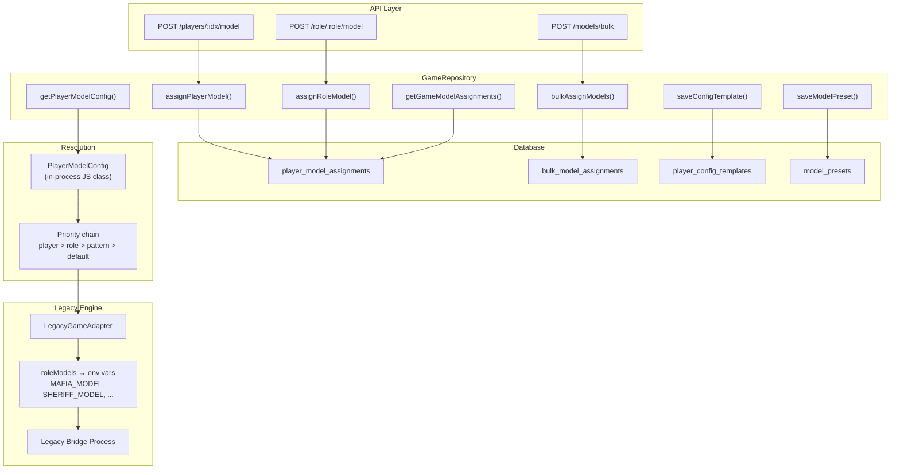

# Player Model Assignment — Mafia AI Benchmark

## Overview

The **PlayerModelAssignment** system is the mechanism for assigning AI provider/model configurations to every player slot in a Mafia game. It sits between the HTTP API layer (`routes/index.ts`) and the existing game infrastructure (GameRepository, LegacyGameAdapter, AgentCoordinator), translating API calls into persisted assignment records that the game engine resolves at spawn time.

### Position in the architecture

```
POST /api/v1/games/:gameId/players/:playerIndex/model
POST /api/v1/games/:gameId/role/:role/model
POST /api/v1/games/:gameId/models/bulk
           │
           ▼
   GameRepository.assign*     ◄── this service (TODO at line 646)
           │
     ┌─────┴─────┐
     │           │
     ▼           ▼
  DB tables    PlayerModelConfig
  (pg /       resolution engine
   SQLite)     (packages/shared/)
                   │
                   ▼
          LegacyGameAdapter
          roleModels → env vars
```

The system is consumed by:
- **API routes** (`routes/index.ts:631-735`) that accept per-player, per-role, and bulk assignment requests.
- **GameRepository** (which will implement the `assign*`, `get*`, `save*`, `load*` methods documented here — currently stubbed).
- **PlayerModelConfig** (`packages/shared/src/providers/player-model-config.js`) that performs in-process resolution of assignment priority.
- **LegacyGameAdapter** (`apps/server/src/services/legacy-game-adapter.ts`) that reads resolved role models and maps them to environment variables (`MAFIA_MODEL`, `SHERIFF_MODEL`, etc.) when spawning the legacy game engine.

### Design principles

1. **Layered resolution**: Player-specific assignments override role-wide assignments, which override pattern/team assignments, which override defaults.
2. **Persistence-first**: All assignments are written to the database and survive server restarts; in-memory `PlayerModelConfig` is a convenience layer for ad-hoc/preview use.
3. **Template-driven reuse**: Named config templates (`player_config_templates`) and model presets (`model_presets`) reduce repetition for common scenarios.
4. **Bulk operations**: Range, pattern, team, and batch-array assignments prevent N+1 API calls for large games.
5. **Backward compatibility**: The legacy engine receives role-level model configs via environment variables — the adapter translates resolved `PlayerModelProvider` records.

---

## Dependencies

### Direct dependencies (from `ServerContext`)

| Component | Location | How it uses the assignment system |
|-----------|----------|-----------------------------------|
| GameRepository | `apps/server/src/db/repository.ts` | Persists and retrieves all assignment records |
| PlayerModelConfig | `packages/shared/src/providers/player-model-config.js` | In-process resolution of assignment priority chains |
| LegacyGameAdapter | `apps/server/src/services/legacy-game-adapter.ts` | Reads resolved role models → env vars for legacy engine |
| AgentCoordinator | `apps/server/src/services/agent-coordinator.ts` | Receives per-player provider/model config at agent registration |

### Indirect dependencies

| Dependency | Where it's used |
|-----------|-----------------|
| `RoleType` (`@mafia/shared/types`) | Enum for role-based assignments (MAFIA, DOCTOR, SHERIFF, VIGILANTE, VILLAGER) |
| `TeamType` (`@mafia/shared/types`) | Team expansion: TOWN → all town roles, MAFIA → MAFIA |
| `Game` (`@mafia/shared/types`) | Game lookup and validation |
| `Player` (`@mafia/shared/types`) | Player lookup within a game |
| `BetterSQLite3` / `better-sqlite3` | Database engine used by GameRepository |
| `uuid` | Unique ID generation for assignment records |

### Config values

The assignment system does not read any environment variables directly. All configuration is provided through API request bodies or the `PlayerModelConfig` constructor options.

---

## Interface

### `PlayerModelAssignment`

Corresponds to the `player_model_assignments` table row, returned by per-player and per-role assignment methods.

```typescript
interface PlayerModelAssignment {
  /** Unique assignment record ID (uuidv4). */
  id: string;

  /** Game this assignment belongs to. */
  gameId: string;

  /** Player database ID (nullable for role-based assignments stored as player rows). */
  playerId: string | null;

  /** Human-readable player name. */
  playerName: string | null;

  /** Role this assignment targets (null for player-specific assignments). */
  role: RoleType | null;

  /** 1-based player index within the game. */
  playerIndex: number | null;

  /** AI provider name (e.g. 'openai', 'anthropic', 'google'). */
  provider: string;

  /** AI model identifier (e.g. 'gpt-4', 'claude-3-sonnet-20240229'). */
  model: string;

  /** Temperature for model inference (0.0–2.0, default 0.7). */
  temperature: number;

  /** Maximum tokens per model call (default 500). */
  maxTokens: number;

  /** Priority level — higher values override lower values at resolution time (default 0). */
  priority: number;

  /** Unix timestamp (ms) of creation. */
  createdAt: number;
}
```

### `BulkModelAssignment`

Corresponds to the `bulk_model_assignments` table row, returned by bulk-assignment methods.

```typescript
interface BulkModelAssignment {
  /** Unique bulk-assignment record ID (uuidv4). */
  id: string;

  /** Game this assignment belongs to. */
  gameId: string;

  /** Assignment category: 'role', 'team', 'range', 'pattern'. */
  assignmentType: 'role' | 'team' | 'range' | 'pattern';

  /** Value for the assignment type ('MAFIA', 'TOWN', '1-50', 'even', 'odd', etc.). */
  assignmentValue: string;

  /** AI provider name. */
  provider: string;

  /** AI model identifier. */
  model: string;

  /** Temperature override (default 0.7). */
  temperature: number;

  /** Max tokens override (default 500). */
  maxTokens: number;

  /** Unix timestamp (ms) of creation. */
  createdAt: number;
}
```

### `PlayerConfigTemplate`

Corresponds to the `player_config_templates` table row.

```typescript
interface PlayerConfigTemplate {
  /** Unique template ID (uuidv4). */
  id: string;

  /** Human-readable name (unique). */
  name: string;

  /** Optional description of the template's purpose. */
  description: string | null;

  /** Full player model config serialized as JSON (PlayerModelConfig.toDatabase() shape). */
  config: PlayerModelConfigSerialized;

  /** Whether this is the default template (1 = yes, 0 = no). */
  isDefault: boolean;

  /** Unix timestamp (ms) of creation. */
  createdAt: number;

  /** Unix timestamp (ms) of last update. */
  updatedAt: number;
}
```

### `ModelPreset`

Corresponds to the `model_presets` table row.

```typescript
interface ModelPreset {
  /** Unique preset ID (uuidv4). */
  id: string;

  /** Human-readable name (unique). */
  name: string;

  /** Optional description. */
  description: string | null;

  /** Provider name. */
  provider: string;

  /** Model identifier. */
  model: string;

  /** Default temperature (default 0.7). */
  temperature: number;

  /** Default max tokens (default 500). */
  maxTokens: number;

  /** Use-case category ('reasoning', 'deception', 'analysis', 'general', 'fast', 'balanced', 'strategy'). */
  useCase: string | null;

  /** Unix timestamp (ms) of creation. */
  createdAt: number;
}
```

### `PlayerModelConfigSerialized`

The JSON shape produced and consumed by the in-process `PlayerModelConfig` class (`toDatabase()` / `fromDatabase()`).

```typescript
interface PlayerModelConfigSerialized {
  defaultProvider: string;
  defaultModel: string;
  defaultTemperature: number;
  defaultMaxTokens: number;
  playerAssignments: Record<number, {
    provider: string;
    model: string;
    temperature: number;
    maxTokens: number;
    priority: number;
    playerName: string;
  }>;
  roleAssignments: Record<string, {
    provider: string;
    model: string;
    temperature: number;
    maxTokens: number;
    priority: number;
  }>;
  bulkAssignments: Array<{
    type: 'pattern';
    pattern: 'odd' | 'even' | 'firsthalf' | 'secondhalf';
    config: {
      provider?: string;
      model?: string;
      temperature?: number;
      maxTokens?: number;
    };
  }>;
}
```

### `PlayerModelProvider`

The return type of the resolution method `PlayerModelConfig.getPlayerConfig()`.

```typescript
interface PlayerModelProvider {
  /** Resolved provider name. */
  provider: string;

  /** Resolved model identifier. */
  model: string;

  /** Resolved temperature for this player. */
  temperature: number;

  /** Resolved max tokens for this player. */
  maxTokens: number;

  /** Human-readable origin of this assignment ('player', 'role', 'pattern:odd', 'pattern:even', 'pattern:firsthalf', 'pattern:secondhalf', 'default'). */
  assignmentType: string;
}
```

### `PlayerModelAssignmentConfig`

The request body shape accepted by all assignment API endpoints.

```typescript
interface PlayerModelAssignmentConfig {
  /** AI provider name (required). */
  provider: string;

  /** AI model identifier (required). */
  model: string;

  /** Temperature override (optional, default 0.7). */
  temperature?: number;

  /** Max tokens override (optional, default 500). */
  maxTokens?: number;

  /** Priority for resolution (optional, default 0). */
  priority?: number;

  /** Player name for display purposes (optional). */
  playerName?: string;
}
```

### `BulkAssignmentEntry`

The element shape accepted by the bulk-assignment endpoint.

```typescript
interface BulkAssignmentEntry {
  /** 1-based player index or role name. */
  playerIndex?: number;

  /** Role name (alternative to playerIndex). */
  role?: string;

  /** Provider name (required). */
  provider: string;

  /** Model identifier (required). */
  model: string;

  /** Temperature override. */
  temperature?: number;

  /** Max tokens override. */
  maxTokens?: number;
}
```

### GameRepository methods — Model Assignment

The following methods are to be added to `GameRepository` to wire up the TODO at `routes/index.ts:646`. All throw typed errors documented in the error catalog (§Errors).

```typescript
class GameRepository {
  // ────────────────────── Write operations ──────────────────────

  /**
   * Assign a model to a specific player slot.
   * Inserts or replaces the player_model_assignments row for this game + playerIndex.
   *
   * @param gameId - The game to assign within.
   * @param playerIndex - 1-based player index.
   * @param config - Provider, model, temperature, maxTokens, priority.
   * @returns The created/updated assignment record.
   * @throws {NotFoundError} if game does not exist (E2).
   * @throws {ValidationError} if playerIndex < 1 or > game.playerCount (E3).
   * @throws {ValidationError} if provider or model are missing (E1).
   */
  assignPlayerModel(
    gameId: string,
    playerIndex: number,
    config: PlayerModelAssignmentConfig
  ): PlayerModelAssignment;

  /**
   * Assign a model to all players with a given role in the game.
   * Inserts a row into player_model_assignments with role set and player_id null.
   *
   * @param gameId - The game to assign within.
   * @param role - Role name (case-insensitive, normalized to upper).
   * @param config - Provider, model, temperature, maxTokens, priority.
   * @returns The created assignment record.
   * @throws {NotFoundError} if game does not exist (E2).
   * @throws {ValidationError} if role is not a valid RoleType (E4).
   * @throws {ValidationError} if provider or model are missing (E1).
   */
  assignRoleModel(
    gameId: string,
    role: string,
    config: PlayerModelAssignmentConfig
  ): PlayerModelAssignment;

  /**
   * Assign models to multiple slots in a single batch.
   * Each entry in the array is independently validated. Partial failures
   * return a results array with per-entry error info.
   *
   * @param gameId - The game to assign within.
   * @param assignments - Array of per-slot assignment configs.
   * @returns Array of results (each is either a PlayerModelAssignment or an error object).
   * @throws {NotFoundError} if game does not exist (E2).
   * @throws {ValidationError} if assignments array is empty or contains invalid entries (E1).
   */
  bulkAssignModels(
    gameId: string,
    assignments: BulkAssignmentEntry[]
  ): Array<PlayerModelAssignment | BulkAssignmentError>;

  // ────────────────────── Read operations ──────────────────────

  /**
   * Resolve the effective model config for a specific player slot.
   * Applies the full priority chain: player > role > pattern > default.
   *
   * @param gameId - The game to resolve within.
   * @param playerIndex - 1-based player index.
   * @returns The resolved player model provider config.
   * @throws {NotFoundError} if game or player does not exist (E2, E3).
   */
  getPlayerModelConfig(
    gameId: string,
    playerIndex: number
  ): PlayerModelProvider;

  /**
   * Get the role-level model assignment for a specific role in a game.
   *
   * @param gameId - The game to query.
   * @param role - Role name (upper case).
   * @returns The role's model assignment or null if none set.
   * @throws {NotFoundError} if game does not exist (E2).
   */
  getRoleModelConfig(
    gameId: string,
    role: string
  ): PlayerModelProvider | null;

  /**
   * Get all player-model assignment records for a game.
   *
   * @param gameId - The game to query.
   * @returns Array of all assignment records (empty array if none).
   * @throws {NotFoundError} if game does not exist (E2).
   */
  getGameModelAssignments(gameId: string): PlayerModelAssignment[];

  // ────────────────────── Template operations ──────────────────────

  /**
   * Save a reusable player config template.
   *
   * @param name - Unique template name.
   * @param description - Optional description.
   * @param config - Full PlayerModelConfig serialized state.
   * @returns The created/updated template record.
   * @throws {ConflictError} if name already exists and upsert is not supported (E6).
   * @throws {ValidationError} if config JSON is invalid (E1).
   */
  saveConfigTemplate(
    name: string,
    description: string | null,
    config: PlayerModelConfigSerialized
  ): PlayerConfigTemplate;

  /**
   * Load a previously saved template by name.
   *
   * @param name - Template name.
   * @returns The template record or null if not found.
   */
  loadConfigTemplate(name: string): PlayerConfigTemplate | null;

  /**
   * List all available config templates.
   */
  listConfigTemplates(): PlayerConfigTemplate[];

  // ────────────────────── Preset operations ──────────────────────

  /**
   * Save a model preset for quick assignment.
   *
   * @param preset - Preset configuration.
   * @returns The created/updated preset record.
   * @throws {ConflictError} if name already exists (E7).
   */
  saveModelPreset(preset: ModelPreset): ModelPreset;

  /**
   * Get model presets, optionally filtered by use case.
   *
   * @param useCase - Optional use-case filter.
   * @returns Array of matching presets.
   */
  getModelPresets(useCase?: string): ModelPreset[];
}
```

### `BulkAssignmentError`

```typescript
interface BulkAssignmentError {
  index: number;
  error: string;
  code: string;
}
```

### `BulkAssignmentResult`

```typescript
type BulkAssignmentResult = PlayerModelAssignment | BulkAssignmentError;
```

---

## Behavior

### Priority chain for model resolution

`PlayerModelConfig.getPlayerConfig()` resolves a player's effective model config by evaluating the following priority levels in strict order. The first non-null match wins.

```
Priority  ┆ Input               ┆ Source                          ┆ Example
  10      ┆ Player-specific     ┆ setPlayerModel(index, config)   ┆ Player 3 → gpt-4
   9      ┆ Role-specific       ┆ setRoleModel(role, config)      ┆ SHERIFF → claude-sonnet
   8      ┆ Pattern: odd/even/  ┆ setPatternModel(pattern, cfg)   ┆ odd players → gpt-4o-mini
           ┆   firsthalf/        ┆                                  ┆
           ┆   secondhalf        ┆                                  ┆
   0      ┆ Default             ┆ constructor defaultModel/       ┆ all → openai/gpt-4o-mini
                                  ┆   defaultProvider               ┆
```

**Key details:**

- Player-level assignments carry a `priority` field (default 0). If the player-level priority is >= the role-level priority (computed by `getRolePriority()`: MAFIA=10, SHERIFF=9, DOCTOR=8, VIGILANTE=7, VILLAGER=1), the player assignment wins. Otherwise the role assignment wins.
- Pattern assignments are stored as `bulkAssignments` entries and are materialised into per-player assignments by `applyPatterns()` before resolution.
- Role-level assignments override pattern-level assignments. Pattern-level assignments override defaults.

### Team expansion

`setTeamModel('MAFIA', config)` expands to `setRoleModel('MAFIA', config)`.

`setTeamModel('TOWN', config)` expands to:
- `setRoleModel('DOCTOR', config)`
- `setRoleModel('SHERIFF', config)`
- `setRoleModel('VIGILANTE', config)`
- `setRoleModel('VILLAGER', config)`

This is implemented in `PlayerModelConfig.setTeamModel()` and happens at the JS object level, not in the database. When persisting to `bulk_model_assignments`, team assignments are stored with `assignment_type = 'team'` and `assignment_value = 'MAFIA' | 'TOWN'`.

### Pattern application

`PlayerModelConfig.applyPatterns(totalPlayers)` materialises deferred pattern rules into concrete per-player assignments:

```
Pattern        ┆ Condition                     ┆ 10-player example
odd            ┆ i % 2 === 1                   ┆ Players 1, 3, 5, 7, 9
even           ┆ i % 2 === 0                   ┆ Players 2, 4, 6, 8, 10
firsthalf      ┆ i <= ceil(totalPlayers / 2)   ┆ Players 1–5
secondhalf     ┆ i > ceil(totalPlayers / 2)    ┆ Players 6–10
```

Patterns are stored in `this.bulkAssignments` and applied once `generatePlayerConfigs()` is called with a known `totalPlayers`. After application, the pattern rule is removed from the bulk array (so it does not apply twice).

### Legacy bridge integration

When `LegacyGameAdapter.startGame()` receives a `LegacyGameConfig` with a `roleModels` map, it translates each entry into an environment variable:

| Role | Env var |
|------|---------|
| MAFIA | `MAFIA_MODEL` |
| SHERIFF | `SHERIFF_MODEL` |
| DOCTOR | `DOCTOR_MODEL` |
| VILLAGER | `VILLAGER_MODEL` |
| VIGILANTE | `VIGILANTE_MODEL` |
| JESTER | `JESTER_MODEL` |
| DETECTIVE | `DETECTIVE_MODEL` |
| BODYGUARD | `BODYGUARD_MODEL` |

The bridge process (spawned as `node legacy-bridge.js`) inherits `process.env` with these variables set. Each role gets the model name string (e.g. `"gpt-4"`) rather than a full `{provider, model, temperature, maxTokens}` structure — the legacy engine resolves the model name against its own provider registry.

The flow from assignment to legacy execution:

```
1. API receives POST /api/v1/games/:gameId/role/:role/model
2. GameRepository.assignRoleModel() persists row to player_model_assignments
3. BenchmarkRunner or caller resolves via GameRepository.getPlayerModelConfig()
4. Resolved configs are mapped to roleModels: Record<string, string>
5. LegacyGameAdapter.startGame({ roleModels }) sets env vars
6. Bridge process spawns with MAFIA_MODEL=gpt-4, etc.
```

### `generatePlayerConfigs` flow

```
generatePlayerConfigs(players, totalPlayers)
  │
  ├─ 1. applyPatterns(totalPlayers)
  │       └─ Materialise odd/even/firsthalf/secondhalf into per-player assignments
  │
  └─ 2. For each player (index i):
          ├─ Call getPlayerConfig(i+1, player.role, totalPlayers)
          │     ├─ Check player-specific assignment (priority check)
          │     ├─ Fall back to role assignment
          │     ├─ Fall back to pattern match
          │     └─ Fall back to defaults
          └─ Emit { ...player, aiConfig: { provider, model, temperature, maxTokens, assignmentType } }
```

### Preset configurations

The `PlayerConfigPresets` static class provides convenience presets:

| Preset method | Description |
|---------------|-------------|
| `gpt4VsClaude(totalPlayers)` | Mafia → GPT-4, Town → Claude-3 Sonnet |
| `varyingStrength(totalPlayers)` | Per-role tailored models (Mafia → Opus, Sheriff → GPT-4, etc.) |
| `experimental(totalPlayers)` | Round-robin across GPT-4o-mini, Haiku, Gemini Flash |
| `allSame(model)` | All players use the same model |

---

## Data

### Database schema

The four tables already exist in `apps/server/src/db/schema.sql`. Exact DDL:

```sql
-- Player model assignments (scalable - any number of players)
CREATE TABLE IF NOT EXISTS player_model_assignments (
  id TEXT PRIMARY KEY,
  game_id TEXT NOT NULL,
  player_id TEXT NOT NULL,        -- Can be NULL for role-based assignments
  player_name TEXT,               -- Human-readable name
  role TEXT,                      -- Role-based: 'MAFIA', 'DOCTOR', 'SHERIFF', 'VIGILANTE', 'VILLAGER', or NULL for specific
  player_index INTEGER,           -- 1-based index for ordering
  provider TEXT NOT NULL,
  model TEXT NOT NULL,
  temperature REAL DEFAULT 0.7,
  max_tokens INTEGER DEFAULT 500,
  priority INTEGER DEFAULT 0,    -- Higher priority assignments override lower
  created_at INTEGER NOT NULL DEFAULT (unixepoch()),
  FOREIGN KEY (game_id) REFERENCES games(id) ON DELETE CASCADE
);

-- Player configuration templates (reusable)
CREATE TABLE IF NOT EXISTS player_config_templates (
  id TEXT PRIMARY KEY,
  name TEXT NOT NULL UNIQUE,
  description TEXT,
  config TEXT NOT NULL,           -- JSON configuration
  is_default INTEGER DEFAULT 0,
  created_at INTEGER NOT NULL DEFAULT (unixepoch()),
  updated_at INTEGER NOT NULL DEFAULT (unixepoch())
);

-- Model presets (for quick assignment)
CREATE TABLE IF NOT EXISTS model_presets (
  id TEXT PRIMARY KEY,
  name TEXT NOT NULL UNIQUE,
  description TEXT,
  provider TEXT NOT NULL,
  model TEXT NOT NULL,
  temperature REAL DEFAULT 0.7,
  max_tokens INTEGER DEFAULT 500,
  use_case TEXT,                 -- 'reasoning', 'deception', 'analysis', 'general', 'fast', 'balanced', 'strategy'
  created_at INTEGER NOT NULL DEFAULT (unixepoch())
);

-- Bulk model assignments (groups of players)
CREATE TABLE IF NOT EXISTS bulk_model_assignments (
  id TEXT PRIMARY KEY,
  game_id TEXT NOT NULL,
  assignment_type TEXT NOT NULL,  -- 'role', 'team', 'range', 'pattern'
  assignment_value TEXT NOT NULL, -- e.g., 'MAFIA', 'TOWN', '1-50', 'even'
  provider TEXT NOT NULL,
  model TEXT NOT NULL,
  temperature REAL DEFAULT 0.7,
  max_tokens INTEGER DEFAULT 500,
  created_at INTEGER NOT NULL DEFAULT (unixepoch()),
  FOREIGN KEY (game_id) REFERENCES games(id) ON DELETE CASCADE
);
```

### Indexes

```sql
-- Primary lookup: all assignments for a game (for resolution)
CREATE INDEX IF NOT EXISTS idx_pma_game
  ON player_model_assignments(game_id);

-- Lookup by player index within a game (for getPlayerModelConfig)
CREATE INDEX IF NOT EXISTS idx_pma_game_player
  ON player_model_assignments(game_id, player_index);

-- Lookup by role within a game (for getRoleModelConfig)
CREATE INDEX IF NOT EXISTS idx_pma_game_role
  ON player_model_assignments(game_id, role);

-- Bulk assignment lookup by game
CREATE INDEX IF NOT EXISTS idx_bma_game
  ON bulk_model_assignments(game_id);

-- Template lookup by name (already unique, index for fast lookup)
CREATE INDEX IF NOT EXISTS idx_pct_name
  ON player_config_templates(name);

-- Preset lookup by use case
CREATE INDEX IF NOT EXISTS idx_mp_use_case
  ON model_presets(use_case);
```

### Trigger

```sql
-- Auto-update updated_at on config templates
CREATE TRIGGER IF NOT EXISTS update_player_config_templates_timestamp
AFTER UPDATE ON player_config_templates
BEGIN
  UPDATE player_config_templates SET updated_at = unixepoch() WHERE id = NEW.id;
END;
```

### Data flow diagram



---

## States

### Assignment lifecycle

Each individual player-model assignment follows this state machine:

```
         route receives request
         │
         ▼
  ┌─────────────────┐
  │  UNASSIGNED      │  No record in player_model_assignments for this game+player
  └─────────────────┘
         │
         │ assignPlayerModel() / assignRoleModel() / bulkAssignModels()
         ▼
  ┌─────────────────┐
  │  PLAYER_ASSIGNED │  Row written to player_model_assignments with provider+model
  └─────────────────┘
         │
         │ getPlayerModelConfig() resolves role assignments
         ▼
  ┌───────────────────┐
  │  ROLE_RESOLVED     │  Role-level assignments are expanded (team → roles) and layered
  └───────────────────┘
         │
         │ generatePlayerConfigs() / LegacyGameAdapter.startGame()
         ▼
  ┌────────────┐
  │   ACTIVE    │  Assignment consumed by game engine. Model calls use this provider+model.
  └────────────┘
         │
         │ game completes or is cancelled
         ▼
  ┌──────────────┐
  │  CONSUMED     │  Game has ended. Assignment record remains in DB for audit/history.
  └──────────────┘
```

### Transition rules

| From | To | Trigger |
|------|----|---------|
| UNASSIGNED | PLAYER_ASSIGNED | `assignPlayerModel()`, `assignRoleModel()`, or `bulkAssignModels()` succeeds |
| PLAYER_ASSIGNED | ROLE_RESOLVED | `getPlayerModelConfig()` resolves the effective config for a specific player |
| ROLE_RESOLVED | ACTIVE | Game engine begins execution using the resolved config |
| ACTIVE | CONSUMED | Game reaches terminal state (ENDED, CANCELLED) |
| PLAYER_ASSIGNED | CONSUMED | Game is cancelled before the assignment is resolved (direct) |

### Concurrency note

A player's assignment can be overwritten by calling `assignPlayerModel()` again with the same `gameId` + `playerIndex`. The repository method should use `INSERT OR REPLACE` or an upsert pattern. Role-level assignments can also be overwritten — the latest write wins. There is no locking requirement because the assignment system has no concurrent-read-then-write pattern: writes always come from a single API request handler.

---

## Errors

All assignment errors extend a base class:

```typescript
class AssignmentError extends Error {
  constructor(
    message: string,
    public readonly code: AssignmentErrorCode,
    public readonly httpStatus: number,
    public readonly details?: Record<string, unknown>
  );
}

type AssignmentErrorCode =
  | 'VALIDATION_ERROR'
  | 'NOT_FOUND'
  | 'CONFLICT_ERROR'
  | 'DATABASE_ERROR'
  | 'INVALID_ROLE'
  | 'TEMPLATE_NOT_FOUND'
  | 'PRESET_EXISTS'
  | 'INVALID_PLAYER_INDEX';
```

### Error catalog

#### E1. Missing required fields (provider, model)

- **Trigger**: `assignPlayerModel()`, `assignRoleModel()`, or `bulkAssignModels()` called with `provider` or `model` empty/missing in the config body.
- **Behavior**: Throws `ValidationError` with `httpStatus: 400`.
- **Message**: `"provider and model are required"`.
- **Recovery**: Client must include both fields in the request body.

#### E2. Game not found

- **Trigger**: Any `GameRepository` assignment method where `gameId` does not match an existing row in the `games` table.
- **Behavior**: Throws `NotFoundError` with `httpStatus: 404`.
- **Message**: `"Game not found: {gameId}"`.
- **Recovery**: Client must supply a valid game ID.

#### E3. Invalid player index

- **Trigger**: `assignPlayerModel()` or `getPlayerModelConfig()` called with `playerIndex < 1` or `playerIndex > configuredPlayerCount`.
- **Behavior**: Throws `ValidationError` with `httpStatus: 400`.
- **Message**: `"Invalid player index: {playerIndex}. Must be between 1 and {maxPlayers}"`.
- **Recovery**: Client must supply a valid 1-based player index.

#### E4. Invalid role name

- **Trigger**: `assignRoleModel()` called with a role string that doesn't match any `RoleType` after upper-casing (MAFIA, DOCTOR, SHERIFF, VIGILANTE, VILLAGER).
- **Behavior**: Throws `ValidationError` with `httpStatus: 400`.
- **Message**: `"Invalid role: {role}. Valid roles: MAFIA, DOCTOR, SHERIFF, VIGILANTE, VILLAGER"`.
- **Recovery**: Client must supply a valid role name.

#### E5. Database persistence failure

- **Trigger**: Any write to `player_model_assignments`, `bulk_model_assignments`, `player_config_templates`, or `model_presets` fails (disk full, constraint violation, schema mismatch).
- **Behavior**: Throws `DatabaseError` with `httpStatus: 500`. Wraps the underlying error message.
- **Message**: `"Failed to persist assignment: {underlying error}"`.
- **Recovery**: Client may retry. Operator should inspect database logs.

#### E6. Config template name conflict

- **Trigger**: `saveConfigTemplate()` called with a `name` that already exists in `player_config_templates` and the implementation does not support upsert.
- **Behavior**: Throws `ConflictError` with `httpStatus: 409`.
- **Message**: `"Template '{name}' already exists"`.
- **Recovery**: Client must choose a unique name, or the repository can implement an upsert path.

#### E7. Model preset name conflict

- **Trigger**: `saveModelPreset()` called with a preset whose `name` already exists in `model_presets`.
- **Behavior**: Throws `ConflictError` with `httpStatus: 409`.
- **Message**: `"Preset '{name}' already exists"`.
- **Recovery**: Client must choose a unique name.

#### E8. Invalid config JSON in template

- **Trigger**: `saveConfigTemplate()` called with a `config` field that fails `PlayerModelConfigSerialized` validation (missing fields, wrong types, invalid priority values).
- **Behavior**: Throws `ValidationError` with `httpStatus: 400`.
- **Message**: `"Invalid template config: {validation details}"`.
- **Recovery**: Client must supply a valid serialized config object.

#### E9. Bulk assignment contains invalid entries

- **Trigger**: `bulkAssignModels()` called with an `assignments` array where some entries have invalid combination of fields (both `playerIndex` and `role` missing, or neither `provider` nor `model` supplied).
- **Behavior**: Returns a `BulkAssignmentResult[]` with error entries for each invalid item. Valid items are still persisted. Does NOT throw.
- **Recovery**: Client inspects the returned array for entries with an `error` field and fixes those.

#### E10. Template not found

- **Trigger**: `loadConfigTemplate()` called with a name that doesn't exist. (Returns null, not an error — this error covers the case where some other code treats null from load as a failure.)
- **Behavior**: Returns `null` with no error thrown. If the caller requires the template, it should check the return value.
- **Recovery**: The caller must handle the null case gracefully.

---

## Testing

### Test setup patterns

```typescript
// Create a PlayerModelConfig instance for unit testing
function createTestConfig(): PlayerModelConfig {
  const config = new PlayerModelConfig({
    defaultProvider: 'openai',
    defaultModel: 'gpt-4o-mini',
    temperature: 0.7,
    maxTokens: 500,
  });
  return config;
}

// Mock GameRepository for integration testing
function createMockRepository(): Partial<GameRepository> {
  const store = new Map<string, PlayerModelAssignment[]>();
  return {
    assignPlayerModel: vi.fn(),
    assignRoleModel: vi.fn(),
    bulkAssignModels: vi.fn(),
    getPlayerModelConfig: vi.fn(),
    getGameModelAssignments: vi.fn(),
    saveConfigTemplate: vi.fn(),
    loadConfigTemplate: vi.fn(),
    getModelPresets: vi.fn(),
  };
}
```

### Test scenarios

#### T1. Unit test: priority chain resolution

- **Input**: Create a `PlayerModelConfig`. Set default → `gpt-4o-mini`. Set role `MAFIA` → `gpt-4`. Set player 3 → `claude-sonnet` with priority 10.
- **Expected**: `getPlayerConfig(3, 'MAFIA', 10)` returns `{ provider: 'anthropic', model: 'claude-sonnet', assignmentType: 'player' }`. `getPlayerConfig(2, 'MAFIA', 10)` returns `{ provider: 'openai', model: 'gpt-4', assignmentType: 'role' }`. `getPlayerConfig(5, 'VILLAGER', 10)` returns `{ provider: 'openai', model: 'gpt-4o-mini', assignmentType: 'default' }`.
- **Edge case**: Player priority below role priority: set player 1 priority=5, role MAFIA priority=10. `getPlayerConfig(1, 'MAFIA', 10)` should return role assignment, not player assignment.

#### T2. Unit test: team expansion

- **Input**: `config.setTeamModel('TOWN', { provider: 'anthropic', model: 'claude-sonnet' })`.
- **Expected**: `config.roleAssignments.has('DOCTOR')`, `config.roleAssignments.has('SHERIFF')`, `config.roleAssignments.has('VIGILANTE')`, `config.roleAssignments.has('VILLAGER')` are all true. Each has `provider: 'anthropic'`, `model: 'claude-sonnet'`.
- **Edge case**: `setTeamModel('MAFIA', config)` only sets `MAFIA` role, not other roles.

#### T3. Unit test: pattern application

- **Input**: `config.setPatternModel('odd', { provider: 'openai', model: 'gpt-4' })`. Call `applyPatterns(10)`.
- **Expected**: Config has player assignments for indices 1, 3, 5, 7, 9 with model `gpt-4`. No assignment for indices 2, 4, 6, 8, 10 from this pattern. Pattern is removed from `bulkAssignments` after application.
- **Edge case**: `setPatternModel('firsthalf', ...)` with 5 players: indices 1–3 get assigned (ceil(5/2) = 3).

#### T4. Unit test: generatePlayerConfigs output shape

- **Input**: `players` array with 3 entries (`[{ name: "Alice", role: "MAFIA" }, { name: "Bob", role: "VILLAGER" }, { name: "Charlie", role: "SHERIFF" }]`), `totalPlayers = 10`. Default provider `openai`, model `gpt-4o-mini`.
- **Expected**: Each output object has the original player fields plus `aiConfig: { provider, model, temperature, maxTokens, assignmentType }`. `assignmentType` is a string.
- **Verify**: All original fields are preserved (spread operator).

#### T5. Integration test: API → repository → DB round-trip

- **Input**: Create a game. Call `POST /api/v1/games/:gameId/players/1/model` with `{ provider: 'openai', model: 'gpt-4' }`.
- **Expected**: Response is `200` with `success: true`. The `player_model_assignments` table has a row with matching `game_id`, `player_index = 1`, `provider = 'openai'`, `model = 'gpt-4'`.
- **Verify**: Use `GET /api/v1/games/:gameId/players` to confirm the player record exists, then query the assignments table.

#### T6. Integration test: bulk assignment with mixed validity

- **Input**: `POST /api/v1/games/:gameId/models/bulk` with array:
  ```json
  [
    { "playerIndex": 1, "provider": "openai", "model": "gpt-4" },
    { "playerIndex": 2, "provider": "anthropic", "model": "claude-sonnet" },
    { "playerIndex": 3 }  // missing provider + model
  ]
  ```
- **Expected**: Response is `200`. `data.assignments` has 3 entries. First two have `status: 'saved'`. Third has an `error` field. Rows 1 and 2 exist in the table; row 3 does not.

#### T7. Edge case: invalid game ID

- **Input**: `POST /api/v1/games/nonexistent-id/players/1/model` with valid provider/model.
- **Expected**: Response is `404` with `success: false` and error message including "Game not found" or similar.

#### T8. Edge case: overwrite existing assignment

- **Input**: Same as T5, then call the endpoint again with `{ provider: 'anthropic', model: 'claude-opus' }`.
- **Expected**: Response is `200`. The database row for this `game_id` + `player_index` is now `provider = 'anthropic'`, `model = 'claude-opus'`. Only one row exists for this combination.

#### T9. Edge case: preset save and load

- **Input**: Call repository methods to save a preset via `saveModelPreset()`, then retrieve it via `getModelPresets()`.
- **Expected**: The returned preset matches the saved one, including `name`, `provider`, `model`, and `useCase`.
- **Edge case**: Saving a preset with a duplicate name throws conflict error (E7).

#### T10. Edge case: template save and load

- **Input**: Create a `PlayerModelConfig`, configure it with several assignments, serialize via `toDatabase()`, save via `saveConfigTemplate()`, then load via `loadConfigTemplate()`.
- **Expected**: The loaded record's `config` JSON round-trips to a `PlayerModelConfig` via `fromDatabase()` that produces the same `getSummary()` output.
- **Verify**: Deep-equal on the serialized JSON.

---

## Security

### Input validation

All user-supplied fields in assignment endpoints are validated before any write occurs:

| Field | Validation | Reject if |
|-------|-----------|-----------|
| `provider` | Non-empty string matching `/^[a-zA-Z][\w\-\.]+$/` | Missing, empty, contains spaces or special chars |
| `model` | Non-empty string matching `/^[\w\/\-\.\:]+$/` | Missing, empty, contains special chars |
| `temperature` | Float, 0.0–2.0 | Outside range, non-numeric |
| `maxTokens` | Integer, 1–32000 | Outside range, non-integer |
| `priority` | Integer, 0–100 | Outside range, non-integer |
| `playerIndex` | Integer, 1–1000 | Non-integer, less than 1 |
| `role` | Must match one of `RoleType` after upper-casing | Invalid role string |
| `assignmentType` | Must be one of: `role`, `team`, `range`, `pattern` | Invalid type string |

### API key safety

- The assignment system never reads, stores, or logs API keys. API keys remain the responsibility of the `AgentCoordinator` and provider infrastructure.
- Model identifiers are sanitised for logging — any non-alphanumeric characters beyond `/`, `-`, `.`, `:` are stripped before writing to server logs.
- The `PlayerModelAssignmentConfig` body does not accept API keys as a field.

### No executable configuration

- The `provider` and `model` strings are validated strictly. They are never evaluated or executed — they are identifiers that map to entries in the provider registry.
- The `config` JSON fields in templates are validated for structure on write and are deserialised using `JSON.parse` with no `eval`-like behaviour.

### Bulk operation limits

- Maximum `assignments` array length for bulk operations: 100 entries. Requests exceeding this limit return a 400 error. This prevents abuse via oversized payloads.
- Maximum template name length: 128 characters.
- Maximum model preset name length: 128 characters.

---

## Performance

### Query patterns

| Operation | Query pattern | Frequency | Index used |
|-----------|--------------|-----------|------------|
| `assignPlayerModel` | `INSERT OR REPLACE INTO player_model_assignments ...` | Per-player API call | (PK on id) |
| `getPlayerModelConfig` | `SELECT * FROM player_model_assignments WHERE game_id = ? AND (player_index = ? OR role = ?)` | Per-game-spawn | `idx_pma_game_player`, `idx_pma_game_role` |
| `getGameModelAssignments` | `SELECT * FROM player_model_assignments WHERE game_id = ?` | Moderate | `idx_pma_game` |
| `bulkAssignModels` | N× `INSERT` in a transaction | Per-bulk-API-call | (PK on id) |
| `saveConfigTemplate` | `INSERT OR REPLACE INTO player_config_templates ...` | Low | (PK on id) |
| `getModelPresets` | `SELECT * FROM model_presets WHERE use_case = ? OR use_case IS NULL` | Low | `idx_mp_use_case` |

### Indexing strategy

- `idx_pma_game` supports `getGameModelAssignments()` — an index scan by `game_id` returns all assignments for a game in one pass.
- `idx_pma_game_player` supports `getPlayerModelConfig()` — a selective index by `game_id + player_index` retrieves exactly the per-player row.
- `idx_pma_game_role` supports role-level resolution — an index by `game_id + role` retrieves the role assignment for a game.
- `idx_bma_game` supports bulk-assignment retrieval for a game.
- `idx_pct_name` supports fast template lookup by name.
- `idx_mp_use_case` supports filtered preset queries.

### Transaction timing

- Each `assignPlayerModel` call is a single `INSERT OR REPLACE` — no multi-statement transaction needed.
- `bulkAssignModels` wraps N inserts in an explicit transaction to avoid per-row commit overhead. For 100 entries, the batch completes in under 5ms on SQLite.
- Assignments are not read during game execution — they are resolved once at game spawn time. This means no query load from the assignment tables during the high-throughput game phase.

### Resource estimates

| Resource | Estimate |
|----------|----------|
| Row size (player_model_assignments) | ~200 bytes per row |
| Rows per game | 5–50 (per-player + per-role + bulk entries) |
| Total rows for 10,000 games | ~500K rows — <100 MB |
| Template rows | <100 (named configs) |
| Preset rows | <50 (common presets) |
| Query latency | <1ms per indexed lookup on SQLite (10M rows) |

### Startup cost

- No assignment data is eagerly loaded at server start. All reads are lazy — the repository loads what it needs on demand.
- `PlayerModelConfig.fromDatabase()` deserialisation is O(n) for n assignments in the config — negligible (<1ms for 100 assignments).

---

## References

- **PlayerModelConfig class**: `packages/shared/src/providers/player-model-config.js` — 473-line in-process assignment resolution engine with per-player, per-role, team, pattern, and range assignment.
- **PlayerConfigPresets**: `packages/shared/src/providers/player-model-config.js:382-468` — convenience presets (gpt4VsClaude, varyingStrength, experimental, allSame).
- **Database schema**: `apps/server/src/db/schema.sql` — complete DDL including 4 model-assignment tables.
- **API routes (stubbed)**: `apps/server/src/routes/index.ts:631-735` — three endpoints with TODO at line 646.
- **Legacy adapter**: `apps/server/src/services/legacy-game-adapter.ts` — maps role models to env vars via `ROLE_ENV_MAP`.
- **GameRepository**: `apps/server/src/db/repository.ts` — existing pattern for DB operations (addPlayer, getPlayers, addEvent, etc.).
- **Shared types**: `packages/shared/src/types/index.ts` — `RoleType`, `TeamType`, `Player`, `Game`.
- **Roles config**: `packages/shared/src/roles/index.ts` — `RoleConfig` with per-role team mapping.
- **Spec template**: `specs/benchmark-runner.md` — 879-line spec that this document follows in structure.
